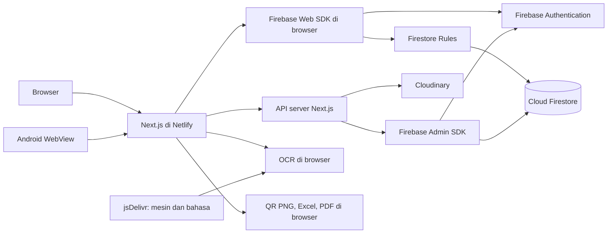
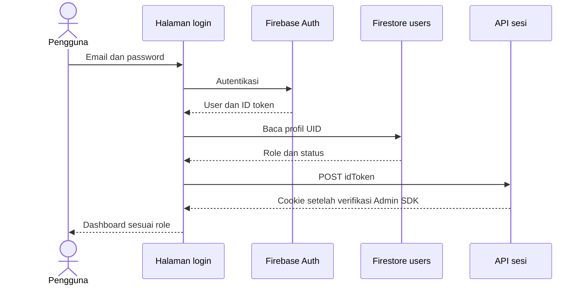
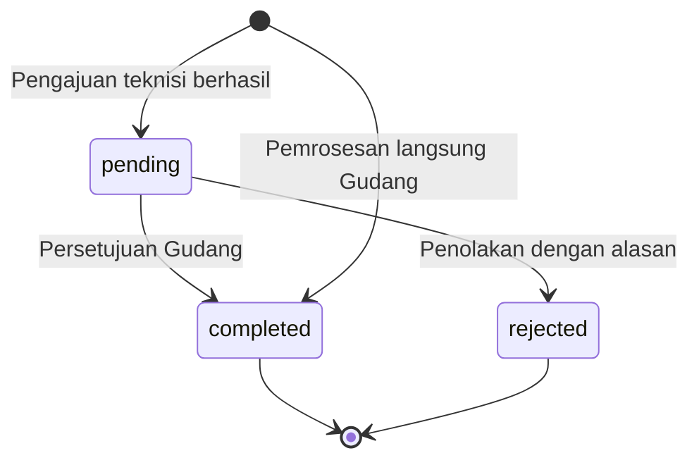

# Dokumentasi Lengkap Aplikasi Inventaris Sparepart Telkomsat Regional 6

Panduan operasional, perilaku data, dan referensi teknis aplikasi web serta Android WebView pada repository [Fadliyuu/Telkomsatt](https://github.com/Fadliyuu/Telkomsatt).

Ditinjau terhadap source lokal pada **9 September 2026**, setelah perubahan scanner gudang, OCR, URL QR, dan logo PDF. Keterangan implementasi menjelaskan source yang diperiksa; status layanan production dan hasil pengujian perangkat perlu diperiksa tersendiri. Alamat web yang dikonfigurasi: [tsatspare.netlify.app](https://tsatspare.netlify.app).

## Daftar isi

1. [Tujuan dan hasil pemeriksaan dokumen lama](#1-tujuan-dan-hasil-pemeriksaan-dokumen-lama)
2. [Konsep inventaris dan istilah](#2-konsep-inventaris-dan-istilah)
3. [Role, menu, dan hak akses](#3-role-menu-dan-hak-akses)
4. [Arsitektur dan pembaruan data](#4-arsitektur-dan-pembaruan-data)
5. [Login, akun, dan profil](#5-login-akun-dan-profil)
6. [Dashboard, inventaris, dan lokasi](#6-dashboard-inventaris-dan-lokasi)
7. [Scan Gudang dan pemrosesan langsung](#7-scan-gudang-dan-pemrosesan-langsung)
8. [Scanner dan pengajuan teknisi](#8-scanner-dan-pengajuan-teknisi)
9. [Verifikasi transaksi dan perubahan stok](#9-verifikasi-transaksi-dan-perubahan-stok)
10. [Impor Excel dan OCR](#10-impor-excel-dan-ocr)
11. [QR, laporan, dan dokumen PDF](#11-qr-laporan-dan-dokumen-pdf)
12. [Notifikasi dan aktivitas](#12-notifikasi-dan-aktivitas)
13. [Kamus data dan penyimpanan lokal](#13-kamus-data-dan-penyimpanan-lokal)
14. [Kontrak API dan keamanan data](#14-kontrak-api-dan-keamanan-data)
15. [Konfigurasi, deployment, dan Android](#15-konfigurasi-deployment-dan-android)
16. [Keterbatasan implementasi yang diketahui](#16-keterbatasan-implementasi-yang-diketahui)
17. [Pengujian, pemulihan, dan pemeliharaan](#17-pengujian-pemulihan-dan-pemeliharaan)
18. [Peta source untuk pengembang](#18-peta-source-untuk-pengembang)

## 1. Tujuan dan hasil pemeriksaan dokumen lama

Aplikasi mencatat identitas unit sparepart, lokasi, kondisi, pergerakan, pengajuan teknisi, dan hasil verifikasi Admin Gudang. QR menghubungkan label fisik dengan ID data aplikasi. Sistem menyediakan impor, laporan, dan pembuatan dokumen pada alur terkait.

| Kebutuhan | Panduan |
|---|---|
| Pengenalan, instalasi, environment, dan bootstrap pengguna | [README](README.md) |
| Langkah kerja, formulir, perubahan data, dan kendala | Dokumen ini, bagian 5–12 |
| Struktur data, API, dan batas keamanan | Bagian 13–16 |
| Uji penerimaan dan pemulihan pekerjaan | Bagian 17 |
| Diagram konteks, DFD, ERD, dan UML | [Arsitektur dan diagram README](README.md#4-arsitektur-sistem) |
| Proyek native dan hosting | [Android](android/README.md), [Netlify](docs/DEPLOY_NETLIFY.md) |

Versi sebelumnya berguna sebagai daftar modul, tetapi banyak penjelasan mengacu ke implementasi lama:

| Keterangan lama | Penjelasan saat ini |
|---|---|
| Scanner dapat digunakan teknisi tanpa login | Alur operasional membutuhkan akun; koleksi teknisi_guest ditolak rules |
| Admin, Karyawan, Teknisi, Magang/PKL adalah role utama | Role utama: Admin Sistem, Admin Gudang, Teknisi, Supervisor |
| Admin memiliki akses penuh ke semua menu | Admin Sistem mengelola pengguna; operasi gudang ditangani Admin Gudang |
| Verifikasi menerima/menghapus item baru | Verifikasi memproses transaksi pending; penolakan mengubah transaksi menjadi rejected |
| Submit keranjang langsung mengubah barang | Pengajuan teknisi menyimpan pending dan reservasi; Scan Gudang memiliki jalur langsung |
| Seluruh data diperbarui otomatis real-time | Sebagian besar halaman membaca saat dibuka/refresh; listener perubahan ada pada notifikasi |
| Aplikasi mendukung offline melalui service worker | Offline penuh belum disediakan; Android membuka server web yang sama |
| Ekspor selalu memuat seluruh database | Cakupan dibatasi query dan pilihan setiap modul |

Istilah **alur layanan** berarti perilaku helper ketika input dan izin sesuai. Kendala UI/integrasi dijelaskan dekat alurnya dan dirangkum pada bagian 16. Keberadaan tipe, helper, atau tombol legacy tidak membuktikan seluruh alurnya dapat dijalankan dengan rules saat ini.

## 2. Konsep inventaris dan istilah

### 2.1 Katalog, unit, dan kelompok

| Konsep | Penyimpanan/peran | Contoh ilustrasi |
|---|---|---|
| Katalog sparepart | spareparts: jenis, kode, kategori, stok, lokasi default | Jenis BUC 2 Watt |
| Unit fisik | sparepart_items: satu perangkat dengan identitas/kondisi sendiri | SN SN-0001, Tag TAG-0001 |
| Kelompok daftar | Pengelompokan di browser menurut nama setelah trim dan status ternormalisasi | Dua BUC Tersedia dalam satu kelompok |
| QR unit | URL `/scan/<id-unit>` | Label untuk satu unit tertentu |
| Master lokasi | lokasi: nama, tipe, alamat, catatan | Gudang atau Site A |

Relasi unit ke katalog melalui `idSparepart` bersifat opsional. Nama perangkat yang sama tidak otomatis membuat atau menautkan katalog. Kelompok tampilan juga tidak membentuk dokumen katalog.

`stokTotal` dan `stokGudang` adalah penghitung pada katalog; jumlah kelompok menghitung unit yang dimuat. Angka dapat berbeda untuk unit tanpa relasi katalog, data lama, batas query, atau operasi yang tidak menyinkronkan penghitung.

### 2.2 Identitas dan dokumen kerja

- **SN / Serial Number**: nomor seri perangkat. Simpan sebagai teks agar nol di depan dan identitas panjang tidak berubah.
- **Tag / tagging**: label inventaris; form tambah dan impor memerlukan minimal SN atau Tag.
- **ID dokumen**: identitas Firestore untuk tautan/relasi; berbeda dari SN atau Tag.
- **SPT**: Surat Perintah Tugas; nomor wajib pada pengajuan OUT/MOVE dan Serah/Bawa Gudang.
- **BA**: Berita Acara. Jenis template berbeda dari jenis transaksi; BA Dismantle tidak otomatis memproses semua unit dengan aksi DISMANTLE.
- **Lokasi**: nama lokasi disimpan sebagai string pada unit/transaksi. Mengubah master tidak memperbarui semua pemakaian nama secara otomatis.

### 2.3 Status yang berbeda

| Field/kelompok | Nilai | Makna |
|---|---|---|
| statusTransaksi | pending, completed, rejected | Tahap pengajuan/hasil transaksi |
| Status unit | Tersedia, Digunakan, Rusak, Hilang, Maintenance, Perlu Pengecekan | Kondisi/status operasional unit |
| cariFisik | Sesuai, Tidak Ditemukan, Outstanding, Mutasi Keluar | Kategori pemeriksaan fisik |
| statusBarang transaksi | Normal, Rusak, Hilang, Perlu Pengecekan | Kategori kondisi pada catatan transaksi |
| perluVerifikasi unit | Boolean legacy | Penanda item lama; berbeda dari transaksi pending |
| Status pengguna | aktif, nonaktif | Status profil aplikasi |

Model mendefinisikan aksi aktif OUT, MOVE, RETURN, DAMAGE dan aksi legacy FOUND, DISMANTLE. Pilihan tombol mengikuti halaman; tidak semua jenis tersedia pada setiap scanner.

Sumber: [model domain](types/index.ts), [konstanta item](lib/constants/sparepartItem.ts), [pengelompokan](lib/utils/sparepartGroups.ts).

## 3. Role, menu, dan hak akses

### 3.1 Empat role utama

| Role | Fokus | Menu utama |
|---|---|---|
| admin — Admin Sistem | Pengguna dan pemantauan | Dashboard, Pengguna, Aktivitas |
| admin_gudang — Admin Gudang | Inventaris, lokasi, scan langsung, verifikasi | Inventaris, Scan Gudang, Verifikasi, Lokasi, Transaksi, Laporan |
| teknisi — Teknisi | Identifikasi unit dan pengajuan | Inventaris untuk dilihat, Scan QR, Pengajuan Saya, Riwayat |
| supervisor — Supervisor | Pengawasan | Inventaris, Transaksi, Laporan, Aktivitas |

Semua role utama memiliki dashboard, profil, dan notifikasi. `direktur`, `manager`, `admin_keuangan` masih ada sebagai role lama. Firestore Rules memetakannya ke supervisor; fallback menu dan beberapa validator API tidak identik dengan pemetaan tersebut.

### 3.2 Peta halaman

| Path | Tujuan | Akses UI utama |
|---|---|---|
| `/`, `/login` | Portal dan login | Halaman masuk |
| `/dashboard` | Dashboard per role | Semua role utama |
| `/spareparts` | Daftar kelompok unit | Gudang, Teknisi, Supervisor |
| `/spareparts/tambah` | Membuat unit fisik | Gudang |
| `/spareparts/<id-unit>/edit` | Edit unit | Gudang |
| `/item/<id-unit>` | Identitas unit dan QR | Gudang, Teknisi, Supervisor |
| `/spareparts/<id-katalog>` | Detail katalog legacy | Role yang boleh melihat inventaris |
| `/spareparts/export-import` | Excel inventaris | Gudang |
| `/spareparts/import-foto` | OCR dan preview impor | Gudang |
| `/spareparts/verifikasi` | Approval Permintaan Transaksi | Gudang |
| `/scan` | Scanner teknisi | Teknisi |
| `/scan/<id>` | Resolusi QR/detail aksi | Mengikuti pemeriksaan role/halaman; bukan jalur tamu |
| `/scan/gudang` | Scanner langsung | Gudang |
| `/transaksi/keranjang` | Keranjang permintaan | Utamanya Teknisi |
| `/transaksi`, `/transaksi/<id>` | Daftar/detail transaksi | Gudang, Teknisi, Supervisor sesuai aturan data |
| `/teknisi/riwayat` | Riwayat teknisi | Teknisi |
| `/lokasi` | Master lokasi | Gudang |
| `/laporan` | Laporan per role | Gudang, Supervisor |
| `/users`, `/users/tambah`, `/users/<uid>/edit` | Pengguna | Admin Sistem |
| `/profile`, `/notifikasi` | Profil/pemberitahuan | Semua role utama |
| `/aktivitas` | Aktivitas berbasis notifikasi | Admin Sistem, Gudang, Supervisor |

Tabel menjelaskan navigasi. Izin data diperiksa lagi oleh rules/handler API. Beberapa link dashboard dapat menuju halaman yang kemudian ditolak RBAC; link Verifikasi tidak memberi kewenangan verifikasi kepada role selain Gudang.

Sumber: [RBAC](lib/rbac.ts), [layout/menu](components/AdminLayout.tsx), [rules](firestore.rules).

## 4. Arsitektur dan pembaruan data



Inventaris/transaksi banyak memakai SDK Firebase klien langsung. API Next.js menangani sesi, akun, profil, dan media. Firebase Admin memakai kredensial server dan melewati rules klien, sehingga handler melakukan otorisasi sendiri.

Web memakai Next.js 14, React 18, TypeScript, Tailwind, Zustand, Firebase, Cloudinary, html5-qrcode, jsPDF, xlsx, dan Tesseract.js. Versi terkunci ada di [package-lock.json](package-lock.json). Build Netlify menggunakan Node.js 22; Android menggunakan Java/WebView.

### 4.1 Kapan data berubah di layar

| Data | Pola pembaruan |
|---|---|
| Inventaris/lokasi | Query saat dibuka, refresh, atau pemuatan ulang setelah aksi |
| Dashboard | Query/count saat komponen memuat data |
| Laporan | Pemuatan mengikuti periode/filter yang memicu query |
| Verifikasi | Query pending saat dibuka/refresh; baris selesai dikeluarkan dari state |
| Lonceng notifikasi | Listener onSnapshot berdasarkan target role/UID |
| Keranjang/draft scan | State browser dengan persistence lokal |

Pencarian yang langsung mengubah tabel adalah penyaringan data di browser, bukan bukti listener database atau pencarian seluruh koleksi. Refresh tetap mengikuti batas query modul.

### 4.2 Batas commit

Pengajuan dan verifikasi menggunakan transaksi Firestore per item/pengajuan. Seluruh keranjang, scan gudang, dan impor tidak disimpan sebagai satu commit global. Sebagian operasi dapat berhasil sebelum operasi berikutnya gagal.

Notifikasi, audit, dan unduhan juga dapat berjalan setelah penyimpanan. Periksa data unit/transaksi sebelum mengulang pekerjaan; toast gagal tidak selalu berarti seluruh perubahan dibatalkan.

## 5. Login, akun, dan profil

### 5.1 Akun dan sesi

Login membutuhkan akun Firebase Authentication dan dokumen `users/<UID>` pada proyek yang sama. Password dikelola Authentication; role/status disimpan pada profil Firestore. Ikuti [bootstrap Admin Sistem](README.md#e-akun-awal) untuk akun pertama.



1. Login manual memeriksa profil dan menolak status persis nonaktif; profil hilang menghasilkan User data not found.
2. ID token ditukar dengan cookie `__session`, berlaku lima hari dan HttpOnly. Production memakai Secure dan SameSite Strict; development memakai Lax.
3. Profil disimpan dalam state Zustand. State lokal bukan bukti otorisasi.
4. AuthProvider mendengarkan perubahan Firebase Auth dan dapat membuat ulang cookie saat sesi dipulihkan. Kegagalan sesi menyebabkan pembersihan cookie/state dan sign-out.
5. Logout klien menghapus cookie melalui API dan memanggil Firebase signOut.

Pemulihan sesi/provider tidak mengulang pemeriksaan status profil yang sama dengan login manual. Endpoint sesi juga tidak menjadi satu-satunya pembatas akun nonaktif. Middleware memeriksa bentuk cookie untuk navigasi; verifikasi identitas dilakukan handler/rules.

### 5.2 Pengelolaan pengguna

| Aksi UI/layanan | Perilaku sebenarnya |
|---|---|
| Tambah pengguna | POST server membuat akun Auth lalu dokumen users; bila profil gagal ditulis, handler mencoba rollback akun Auth |
| Edit pengguna | UI memanggil update profil Firestore langsung |
| Edit email pada UI | Mengubah email profil; tidak mengganti email login Firebase Auth |
| Toggle status pada UI | Mengubah status Firestore; tidak mengubah disabled pada Auth |
| Hapus melalui API yang dipakai UI | Soft delete: Auth dinonaktifkan dan profil diberi status nonaktif/deletedAt; bukan penghapusan permanen |
| Restore melalui PATCH API | Mengaktifkan Auth dan profil; UI saat ini belum memanggil jalur restore tersebut |
| Ganti password administratif | PUT server, Admin Sistem aktif, lalu mencabut refresh token |

Modal hapus UI masih menyebut penghapusan akun/data, sedangkan handler melakukan soft delete. Mengaktifkan status lewat toggle tidak otomatis memulihkan akun yang dinonaktifkan pada Auth. Periksa kedua layanan saat menangani akun tersebut.

### 5.3 Profil dan password pribadi

`/profile` menyediakan nama, nomor HP, alamat, foto, dan perubahan password. PATCH profil hanya memperbarui UID pemilik token; role/status bukan field profil mandiri.

Foto profil dapat digeser/di-zoom dan dihasilkan menjadi JPEG 512 × 512 sebelum upload. Alurnya upload → PATCH profil → perbarui state → coba hapus foto lama. Upload memiliki kendala kontrak respons pada bagian 16, dan penghapusan file lama bersifat best effort.

Password pribadi memakai Firebase Web SDK: verifikasi ulang dengan password sekarang, lalu updatePassword. UI meminta minimal enam karakter dan konfirmasi sama. Lupa password memakai email reset Firebase dengan URL kembali berbasis alamat aplikasi; bukan endpoint email khusus proyek.

Sumber: [auth](lib/firebase/auth.ts), [AuthProvider](components/AuthProvider.tsx), [pengguna](lib/firebase/users.ts), [API pengguna](app/api/admin/users/route.ts), [profil](app/profile/page.tsx).

## 6. Dashboard, inventaris, dan lokasi

### 6.1 Dashboard menurut role

| Tampilan | Cakupan penting |
|---|---|
| Admin Gudang | Transaksi 30 hari, helper maksimal 100, tabel 8 terbaru; rincian kondisi dari 50 unit termuat |
| Supervisor | Ringkasan 7 hari melalui query komponen sendiri |
| Admin Sistem | Tampilan default 7 hari dengan query langsung, tabel 10 terbaru; sebagian link dapat ditolak RBAC |
| Teknisi | Transaksi 30 hari, helper maksimal 100 sebelum filter nama, 8 terbaru; terpengaruh kendala query UID/rules |

Total unit dapat memakai count seluruh koleksi, sedangkan rincian kondisi memakai daftar terbatas. Badge item perluVerifikasi dan jumlah transaksi pending berbeda sumber. Jangan membandingkan kartu tanpa memeriksa cakupannya.

### 6.2 Daftar dan pencarian inventaris

`/spareparts` memuat maksimal **50 unit terbaru**, memfilter di browser, lalu membentuk kelompok nama/status. Pagination menampilkan **15 kelompok**, bukan 15 unit, dan tidak otomatis mengambil halaman database berikutnya.

1. Buka Inventaris dan tunggu pemuatan selesai.
2. Cari nama, SN, Tag, status, atau lokasi; pencarian tidak membedakan huruf besar/kecil.
3. Pilih status bila diperlukan, lalu buka detail kelompok.
4. Cocokkan SN/Tag dan lokasi unit sebelum edit/hapus/membuka QR.
5. Bila unit tidak ditemukan dalam daftar, periksa batas pemuatan; hasil pencarian bukan seluruh database.

Ringkasan lokasi kelompok memakai lokasi terbanyak atau gabungan lokasi dominan. Lokasi minoritas dapat tidak terlihat di ringkasan; buka rincian tiap unit.

### 6.3 Seleksi, perubahan massal, dan ekspor

| Aksi | Cakupan/perilaku |
|---|---|
| Checkbox baris kelompok | Memilih seluruh unit kelompok |
| Pilih Semua Filter pada panel Seleksi Data | Memilih seluruh hasil filter termuat, termasuk kelompok di halaman lain |
| Ganti filter utama | Pilihan yang tidak lagi cocok dikeluarkan dari seleksi |
| Terapkan Update | Target pilihan atau hasil filter; field kosong tertentu tidak diubah; periksa dialog konfirmasi |
| Hapus Pilihan/Hasil Filter/Semua Data | Cakupan sesuai tombol, seluruhnya terbatas data termuat |

Panel Seleksi Data muncul setelah ada pilihan. Penghapusan lebih dari 20 unit meminta pengetikan HAPUS. Update/hapus berjalan per unit dan dapat berhasil sebagian. Operasi unit langsung tidak otomatis membuat transaksi, menyesuaikan katalog, atau menghapus transaksi, lock, dan media terkait.

Modal ekspor memiliki pilihan/filter sendiri yang direset ketika dibuka, bukan mengikuti checkbox daftar utama. Filter mencakup teks, status, lokasi, dan cari fisik. **Export Semua Hasil Filter** memakai filter aktif; **Export Pilihan** memakai semua ID terpilih, termasuk pilihan yang kemudian tersembunyi oleh filter baru.

### 6.4 Tambah, edit, dan detail unit

`/spareparts/tambah` membuat unit fisik, dengan nama dan minimal SN/Tag wajib. Default normalisasi: Tersedia, Sesuai, Gudang. Helper create memeriksa kecocokan SN dan Tag sebelum menulis. Form ini tidak membuat katalog, relasi katalog, kategori, atau foto.

Autocomplete nama mengambil saran dari maksimal 500 unit dengan cache lima menit. Memilih nama tidak menautkan katalog. Setelah simpan, periksa detail unit dan QR.

`/spareparts/<id-unit>/edit` membaca sparepart_items dan mengedit identitas, status, cari fisik, lokasi, serta keterangan. Validasi edit berbeda dari create: nama dan duplikasi SN diperiksa, tetapi minimal SN/Tag serta duplikasi Tag belum diperiksa dengan cara yang sama. Pengecekan identitas aplikasi bukan constraint unik SQL untuk penulisan serentak.

`/item/<id-unit>` menampilkan identitas dan QR, dengan tautan edit untuk Gudang. Halaman ini tidak menyediakan seluruh tabel riwayat, upload foto, dan tombol hapus seperti uraian lama. Hapus satu unit tersedia pada detail kelompok.

### 6.5 Katalog legacy

`/spareparts/<id-katalog>` menampilkan katalog, foto, restock penghitung, dan riwayat yang mereferensikan ID katalog langsung. Restock menambah stokTotal/stokGudang tanpa membuat unit SN/Tag; riwayat tidak menggabungkan semua transaksi unit terkait.

Tombol Edit katalog mengarah ke halaman edit yang membaca unit, sehingga dapat menghasilkan item tidak ditemukan. Helper create katalog tersedia, tetapi tidak ditemukan pemanggil UI utama untuk alur pembuatan katalog saat peninjauan. Jangan menganggap CRUD katalog lengkap tersedia melalui halaman tambah unit.

### 6.6 Master lokasi

Admin Gudang mengelola nama, tipe Gudang/Site/Customer/Workshop/Lainnya, alamat, dan keterangan pada `/lokasi`. Nama wajib. Gunakan nama konsisten dan periksa hasil simpan sebelum menggunakannya pada pekerjaan berikutnya.

Ubah/hapus master tidak memperbarui string lokasi pada unit/transaksi secara berantai. Selain itu, field opsional kosong dapat dikirim sebagai undefined dan ditolak Firestore karena helper belum menyaringnya. Bila simpan gagal, periksa error/payload dan hasil database.

Sumber: [daftar](app/spareparts/page.tsx), [tambah](app/spareparts/tambah/page.tsx), [edit](app/spareparts/[id]/edit/page.tsx), [detail unit](app/item/[id]/page.tsx), [katalog](app/spareparts/[id]/page.tsx), [lokasi](app/lokasi/page.tsx).

## 7. Scan Gudang dan pemrosesan langsung

### 7.1 Persiapan dan identifikasi

Gunakan akun Admin Gudang di `/scan/gudang`. Scanner membaca unit terdaftar. Alternatif **ID Manual** mencari melalui ID, SN, atau Tag.

Saran manual mulai dimuat setelah dua karakter dengan jeda 250 ms. Helper saran memeriksa hingga 200 unit terbaru dan komponen menampilkan hingga delapan hasil. Tidak munculnya saran belum membuktikan unit tidak ada; gunakan identitas persis.

Scan ulang unit sama memperbarui baris lama, menambah scanCount, dan memilih baris kembali. Payload scan ulang dapat mengganti mode/nilai draft sesuai mode aktif dan data terbaru. Scan ulang bukan menambah kuantitas unit fisik yang sama.

### 7.2 Mode dan formulir

| Mode | Input utama | Validasi dan hasil |
|---|---|---|
| Update Status — UPDATE | Status, lokasi baru, keterangan per unit/draft | Terapkan massal hanya ke UPDATE tercentang; submit memperbarui patch dan mencatat transaksi |
| Serah / Bawa — MOVE | Role/nama penerima aktif, SPT, tujuan, keterangan | Penerima, SPT, tujuan wajib; status unit ditargetkan Digunakan |
| Lapor Rusak — DAMAGE | Lokasi barang dan keterangan kerusakan | Lokasi wajib; status ditargetkan Rusak; penerima/SPT tidak wajib bila tanpa BA |

Form mengikuti mode aktif **dan mode yang masih ada dalam daftar**. Mengganti mode tidak mengubah semua baris lama. Bila mode bercampur, periksa setiap baris dan metadata yang dipakai bersama.

### 7.3 SOP Update Status

1. Pilih Update Status dan scan/pilih unit.
2. Periksa nilai awal status, lokasi, dan keterangan.
3. Edit satu baris, atau centang beberapa baris UPDATE untuk perubahan massal.
4. Isi nilai massal lalu klik **Terapkan**. Keterangan/lokasi massal kosong tidak dipakai untuk mengosongkan nilai lama.
5. Tinjau draft tiap unit; Terapkan belum menyimpan ke Firestore.
6. Hapus unit yang tidak termasuk pekerjaan dari daftar.
7. Klik **Proses & Simpan**, lalu periksa data unit dan transaksi.

**Centang bukan pembatas submit:** Proses & Simpan memproses seluruh daftar, termasuk unit tidak dicentang. Jalur UPDATE mencatat transaksi jenis MOVE dengan keterangan pembaruan data; catatan MOVE ini tidak selalu berarti penyerahan fisik baru.

### 7.4 SOP Serah/Bawa dan Lapor Rusak

1. Pilih mode dan scan unit yang benar.
2. Untuk Serah/Bawa, pilih role dan nama penerima dari akun aktif, isi SPT, lokasi tujuan, dan keterangan.
3. Untuk Lapor Rusak, isi lokasi dan uraian kondisi; data penanggung jawab diwajibkan jika BA diaktifkan.
4. Pisahkan daftar untuk pekerjaan dengan penerima/lokasi/metadata berbeda.
5. Pilih dokumen bila perlu, periksa semua baris, lalu klik Proses & Simpan.
6. Cocokkan status/lokasi unit dan Daftar Transaksi setelah selesai.

Pada jalur langsung, pembaruan unit dan pencatatan transaksi tidak selalu satu commit atomik. submitCartTransaction menangkap kegagalan update unit sebelum melanjutkan pencatatan. Karena itu, completed perlu dicocokkan dengan hasil perubahan unit jika proses mengalami kendala.

### 7.5 Surat Jalan dan BA

Surat Jalan tersedia ketika ada unit MOVE; generator menyaring baris MOVE. BA adalah opsi terpisah. Ketika BA dicentang, role/nama penanggung jawab dan lokasi site diwajibkan.

| Kelompok form BA | Data yang dapat diisi |
|---|---|
| Pekerjaan | Jenis BA, pelanggan, site, alamat |
| Kontak | Penanggung jawab/teknisi, nomor HP, PIC dan nomor HP |
| Referensi | Nomor tiket complaint dan maintenance |
| Maintenance | PM/CM dan pilihan layanan |
| Hasil | Sumber masalah, tindakan, ringkasan, pekerjaan tambahan |

Tidak semua field tambahan diwajibkan UI; isi sesuai dokumen kerja. Jenis template: Maintenance, Pemeliharaan/Troubleshooting, Pemasangan, Aktivasi, Dismantle.

Urutan proses: **simpan data → unduh dokumen → tampilkan sukses → kosongkan item**. Bila PDF gagal, daftar dapat tetap tampil meski database sudah berubah. Jangan mengulang Proses & Simpan hanya untuk memicu unduhan sebelum memeriksa transaksi.

clearAll pada store hanya mengosongkan item. Mode dan metadata dokumen tetap tersimpan; periksa penerima, SPT, site, dan catatan sebelum pekerjaan berikutnya.

Sumber: [Scan Gudang](components/scan/AdminGudangScanView.tsx), [store](lib/store/useAdminScanStore.ts), [submit gudang](lib/firebase/adminScanSubmit.ts).

## 8. Scanner dan pengajuan teknisi

### 8.1 Langkah penggunaan

1. Login sebagai Teknisi, buka `/scan`, dan izinkan kamera.
2. Pilih aksi: **Bawa** (MOVE), **Rusak** (DAMAGE), **Dismantle**, atau **Ditemukan**; dua terakhir adalah alur legacy.
3. Identifikasi unit melalui QR atau manual/pencarian yang tersedia; cocokkan SN/Tag.
4. Tambahkan ke keranjang dan periksa aksi/kondisi setiap unit.
5. Buka **Pengajuan Saya** (`/transaksi/keranjang`), berjudul Keranjang Permintaan.
6. Isi tujuan, keterangan, dan bukti sesuai form. Kirim bila validasi dapat dipenuhi.
7. Pengajuan yang berhasil membuat transaksi pending per item dan menunggu Admin Gudang.

### 8.2 Kendala SPT

OUT/MOVE mewajibkan SPT pada submit dan helper. Namun keranjang mendeklarasikan state nomor SPT tanpa merender input atau mengisi state tersebut. Akibatnya **Bawa/MOVE tertahan validasi SPT pada UI ini**.

Perbaikan membutuhkan perubahan aplikasi. Untuk pekerjaan penyerahan langsung oleh Admin Gudang, tersedia Serah/Bawa pada bagian 7. Jalur ini menghasilkan completed dan tidak melewati pending/approval teknisi.

### 8.3 Barang baru dan aksi legacy

Quick Add lama masih ada, tetapi rules membatasi create/update unit ke Admin Gudang. Minta Gudang mencatat unit yang belum ada. Nama teknisi atau session token lokal tidak memberikan akses tamu maupun identitas terverifikasi.

FOUND/DISMANTLE memiliki kondisi tambahan. Helper approval hanya memetakan status baru secara eksplisit untuk OUT/MOVE, DAMAGE, RETURN. Jangan menganggap pemrosesan kondisi legacy sama dengan jalur langsung Gudang.

### 8.4 Riwayat dan pengiriman ulang

Riwayat memakai getTransactions yang belum memfilter UID pengaju di query Firestore, sementara rules membatasi teknisi ke transaksi miliknya. Query dapat ditolak. Daftar kosong setelah gagal dimuat bukan bukti pengajuan belum tersimpan; konfirmasi melalui Gudang.

Pengiriman keranjang dapat berhasil sebagian. Cocokkan transaksi pending dan reservasi sebelum mencoba ulang. Jangan menghapus reservasi hanya agar dapat mengirim ulang tanpa memeriksa transaksi pemiliknya.

Sumber: [scanner](app/scan/page.tsx), [keranjang](app/transaksi/keranjang/page.tsx), [riwayat](components/teknisi/RiwayatTransaksiView.tsx).

## 9. Verifikasi transaksi dan perubahan stok

### 9.1 Langkah verifikasi

`/spareparts/verifikasi` menampilkan **Approval Permintaan Transaksi**, berdasarkan koleksi transaksi dengan statusTransaksi pending, diurutkan terbaru di klien. Ini berbeda dari prosedur edit/verifikasi item baru pada dokumen lama.

1. Login sebagai Gudang dan buka Verifikasi.
2. Periksa identitas unit, pengaju, jenis, SPT, tujuan, waktu, dan keterangan/bukti yang tersedia.
3. Cocokkan dengan barang dan dokumen kerja.
4. Setujui bila sesuai; tolak dengan alasan tidak kosong bila tidak sesuai.
5. Periksa transaksi dan detail unit. Baris selesai dikeluarkan dari daftar pending.

Helper pending menangkap error dan dapat mengembalikan array kosong. Jika daftar kosong secara tidak wajar, periksa log/izin/query sebelum menyimpulkan tidak ada pengajuan.

### 9.2 Transisi status



Approval/rejection memperbarui dokumen transaksi yang sama. Helper menolak transaksi yang tidak lagi pending. Pengajuan ulang setelah penolakan adalah transaksi baru. Rules melarang delete transaksi melalui SDK klien.

### 9.3 Efek approval per item

Tabel berikut khusus executeAtomicApproval, bukan seluruh helper:

| Aksi | Status unit sesudah approval | Katalog bila ditemukan |
|---|---|---|
| OUT/MOVE | Digunakan | stokGudang dikurangi satu jika asal persis Gudang/fallback Gudang; stokTotal tetap |
| DAMAGE | Rusak | stokGudang dan stokTotal dikurangi satu, minimal nol |
| RETURN | Tersedia | stokGudang ditambah satu jika tujuan persis Gudang; stokTotal tetap |
| FOUND/DISMANTLE | Mempertahankan kondisiSebelum/fallback dalam helper | Tidak ada cabang penghitung khusus |

Lokasi unit memakai tujuan pengajuan dengan fallback asal/Gudang. Katalog ditemukan melalui idSparepart milik unit bila ada, atau fallback ID katalog langsung. Unit tanpa katalog dapat berubah tanpa memperbarui penghitung katalog.

Perbandingan lokasi memakai string **Gudang**, bukan tipe master. Nama Gudang Regional 6 tidak otomatis memenuhi perbandingan yang sama. Helper approval menghitung satu unit per pengajuan, bukan kuantitas katalog bebas.

Dalam satu transaksi Firestore, helper membaca sebelum menulis, memperbarui item/katalog terkait, mengubah pending ke completed, mencatat verifikator/waktu, dan menghapus item_locks untuk item tersebut.

### 9.4 Penolakan dan perbedaan jalur langsung

Penolakan mencatat rejected, identitas penolak, waktu, alasan, lalu melepas reservasi. Jalur ini tidak memindahkan unit atau mengubah stok.

createTransaction pada jalur langsung mencari katalog menggunakan transaction.idSparepart langsung. Jika nilainya ID unit, helper tidak otomatis mengikuti relasi katalog unit. Uji perbedaan jalur langsung dan approval saat merekonsiliasi stok unit berkatalog.

Sumber: [verifikasi](app/spareparts/verifikasi/page.tsx), [helper transaksi](lib/firebase/transactions.ts), [tes kontrak](scripts/test-transaction-contracts.cjs).

## 10. Impor Excel dan OCR

### 10.1 Kontrak satu baris

Impor membuat atau memperbarui **unit fisik**. Satu baris adalah satu unit. SN dicari terlebih dahulu; jika tidak ditemukan, pencocokan memakai Tag. Item yang cocok diperbarui, sehingga impor ulang bukan selalu penambahan data.

| Header | Kebutuhan/perilaku |
|---|---|
| No | Nomor urut, bukan ID database |
| Nama Perangkat | Wajib |
| Serial Number | Minimal SN atau Tag diisi; simpan sebagai teks |
| Tag | Identitas alternatif/tambahan |
| Cari Fisik | Default Sesuai jika kosong/tidak dikenali |
| Status Stok | Default Tersedia jika kosong/tidak dikenali |
| Lokasi | Default Gudang jika kosong |
| Kategori | Terbaca pada normalisasi/preview, belum masuk payload simpan |
| Keterangan | Catatan; perlakuan kosong mengikuti payload/helper update |
| Tanggal Update | Hasil ekspor, bukan input tanggal impor |

Contoh ilustrasi:

| Nama Perangkat | Serial Number | Tag | Cari Fisik | Status Stok | Lokasi | Keterangan |
|---|---|---|---|---|---|---|
| BUC 2 Watt | SN-0001 | TAG-0001 | Sesuai | Tersedia | Gudang | Siap digunakan |
| BUC 2 Watt | SN-0002 | TAG-0002 | Sesuai | Rusak | Workshop | Pemeriksaan konektor |

Isi nilai yang ingin dipertahankan ketika memperbarui item lama. Default dapat mengganti status/lokasi sebelumnya. Pastikan pasangan SN/Tag menunjuk unit yang sama.

### 10.2 SOP Excel

1. Login Gudang dan buka `/spareparts/export-import`.
2. Unduh template, lalu ganti baris contoh.
3. Format SN/Tag sebagai teks sebelum memasukkan nol di depan atau identitas panjang.
4. Gunakan sheet pertama; halaman menerima xlsx/xls dan helper membaca sheet pertama saja.
5. Periksa data sebelum memilih file: file valid langsung memulai impor, tanpa tahap preview persetujuan tersendiri.
6. Baca jumlah dibuat, diperbarui, gagal, dan error baris.
7. Cocokkan hasil inventaris sebelum memperbaiki dan mengirim ulang baris gagal.

Impor berjalan per baris tanpa rollback global. Header lama seperti SN, Tagging, Nama, dan kolom Status memiliki normalisasi kompatibilitas. Gunakan header baru **Status Stok** dan **Lokasi** untuk menghindari ambiguitas.

### 10.3 SOP OCR

1. Buka `/spareparts/import-foto`, pilih JPG/PNG atau ambil foto tabel/label.
2. Pastikan teks terang, lurus, tajam, dan latar yang tidak perlu diminimalkan.
3. Jalankan **Proses OCR**; bahasa Indonesia/Inggris dikenali di browser.
4. Periksa teks dan tabel preview, koreksi nama, SN/Tag, status, lokasi, dan catatan.
5. Hapus baris bukan data atau tambah yang terlewat; periksa kolom kosong dan karakter O/0, I/1, Z/7 terhadap foto asli.
6. Ekspor preview bila diperlukan. Ekspor preview belum menyimpan unit.
7. Import setelah baris memenuhi nama dan minimal SN/Tag, lalu tinjau hasil.

Worker/core dan data bahasa dimuat dari jsDelivr; koneksi diperlukan saat belum tersedia di cache. Parser mendukung header, tab, tanda vertikal, dan jarak antarkolom. Confidence bukan jaminan identitas atau pemetaan kolom benar.

Helper ocrRecognition menangani lifecycle worker, pembatalan, dan pembersihan. Tes worker tiruan tidak membuktikan akurasi semua foto atau perangkat.

### 10.4 Cakupan ekspor

| Sumber | Cakupan |
|---|---|
| Export pada halaman Export & Import | Maksimal 50 unit terbaru dari helper bawaan |
| Modal ekspor daftar | Data termuat, kemudian filter/pilihan modal |
| Ekspor pilihan modul terkait | Array unit yang diteruskan pemanggil |
| Preview OCR | Baris hasil koreksi; tidak bergantung pada keberhasilan simpan |

Kategori ekspor inventaris saat ini kosong. Ekspor UI belum menjadi cadangan database lengkap; kebutuhan seluruh inventaris memerlukan perbaikan query/pagination ekspor.

Sumber: [Excel](lib/utils/excel.ts), [kolom/default](lib/constants/sparepartItem.ts), [parser OCR](lib/utils/ocrImport.ts), [worker OCR](lib/utils/ocrRecognition.ts).

## 11. QR, laporan, dan dokumen PDF

### 11.1 Aturan QR

QR unit memuat URL berdasarkan ID, bukan salinan seluruh informasi barang. Origin publik dipilih berurutan:

1. NEXT_PUBLIC_BASE_URL jika merupakan origin HTTPS publik yang diterima helper.
2. Origin browser jika memenuhi aturan yang sama.
3. Fallback https://tsatspare.netlify.app.

Localhost, alamat jaringan lokal tertentu, non-HTTPS, dan URL berkredensial dilewati. QR dari komputer pengembangan dapat menunjuk production fallback.

Preview/unduhan dibuat ulang dari ID sehingga qrCodeUrl lama yang salah tidak harus dimigrasikan untuk memperoleh gambar baru. **Label tercetak tetap harus diunduh dan dicetak ulang.** Kelompok nama/status pada daftar tidak mempunyai QR kolektif; modal kelompok menyediakan QR tiap unit. QR pada detail katalog legacy menggunakan ID katalog, berbeda dari QR unit untuk identitas perangkat tertentu.

### 11.2 Membaca laporan

Query laporan tidak otomatis hanya completed; pending/rejected dapat ikut dimuat. Total transaksi menghitung dokumen, bukan menjumlahkan kuantitas.

getTransactions mengambil maksimal **100 transaksi terbaru** secara bawaan. Filter tanggal/item diterapkan di query; jenis dan nama teknisi difilter setelah pengambilan. Nama penerima/pembawa/teknisi memakai fallback field legacy. Memperlebar periode tidak menghapus limit.

Pada Laporan Gudang, kartu mengikuti periode/teknisi sebelum filter tab, sedangkan PDF mengikuti periode/teknisi/tab aktif. Keluar mencakup MOVE, OUT, DISMANTLE; masuk mencakup RETURN, FOUND; DAMAGE dikelompokkan lainnya. Dashboard Gudang mengklasifikasikan DISMANTLE berbeda, sehingga data legacy perlu direkonsiliasi dari transaksi aslinya.

Sebelum membandingkan angka, samakan periode, filter, tab, status, sumber data, dan hitungan dokumen dibanding jumlah unit.

### 11.3 Dokumen dan aset

| Keluaran | Sumber/penggunaan |
|---|---|
| QR PNG | Identitas unit; QR katalog legacy memakai ID katalog tersendiri |
| Excel inventaris | Unit pada cakupan bagian 10 |
| Laporan Gudang/Transaksi PDF | Hasil query/filter laporan |
| Surat Jalan | Unit MOVE dan metadata penerima/tujuan Scan Gudang |
| BA Maintenance | PM/CM, layanan, site, kontak, hasil pekerjaan |
| Laporan Pemeliharaan | Perbaikan/troubleshooting |
| BA Pemasangan, Aktivasi, Dismantle | Template pekerjaan terkait |

PDF dibuat melalui jsPDF di browser. Logo memakai public/logo/logo.png berukuran 1994 × 829 dengan proporsi dipertahankan. Ikon ODF kecil tidak dipakai sebagai logo cetak. Aset dicoba dari origin browser, kemudian environment base URL bila berbeda; helper dapat melanjutkan tanpa logo jika aset gagal.

Nomor dokumen dihasilkan helper berbasis waktu; source tidak menunjukkan registrasi nomor terpusat dengan constraint unik. Unduhan dan metadata draft tidak otomatis membentuk arsip PDF server. Simpan hasil sesuai tata kelola dokumen organisasi.

Sumber: [URL](lib/utils.ts), [laporan Gudang](components/laporan/LaporanGudangView.tsx), [Surat Jalan](lib/pdf/suratJalan.ts), [template BA](lib/constants/beritaAcara.ts), [PDF bersama](lib/pdf/pdfShared.ts).

## 12. Notifikasi dan aktivitas

Notifikasi disimpan pada notifications dengan targetRoles, targetUids, dan readBy. Helper menggabungkan query role/UID, menghapus duplikasi ID, dan mengurutkan hasil di klien.

| Tampilan | Cakupan |
|---|---|
| Lonceng | Dua listener target role/UID; hingga 20 hasil; badge belum dibaca dihitung dari daftar itu |
| Tandai semua dibaca pada lonceng | Hanya daftar bell saat itu, bukan seluruh koleksi |
| `/notifikasi` | Hingga 200 hasil; tampilan awal 20 lalu bertambah 20 lewat Muat lagi; filter tipe |
| `/aktivitas` | getActivitiesForUser dengan 150 hasil dari notifications, bukan koleksi audit aktivitas |

Kegagalan salah satu query dapat menghasilkan data parsial/kosong karena helper menggunakan Promise.allSettled. Notifikasi desktop memakai API Notification browser dan memerlukan dukungan/izin serta komponen aktif. Belum ada Web Push/service worker atau FCM native yang menjamin pemberitahuan ketika aplikasi ditutup.

Koleksi audit **aktivitas** terpisah menyimpan UID/nama/role aktor, aksi, deskripsi, target, metadata, waktu. Pemanggilan logActivity yang teridentifikasi di UI utama adalah approval/rejection. Daftar tipe AUTH_LOGIN/AUTH_LOGOUT tidak membuktikan kejadian tersebut sudah dicatat. Halaman Aktivitas saat ini bukan tampilan log audit itu.

Kegagalan notifikasi/audit best effort tidak membatalkan penyimpanan utama. Rules notifikasi juga lebih luas daripada target UI; pemilahan target bukan isolasi data penuh. Target default helper tidak selalu mencakup seluruh empat role; tidak adanya notifikasi bukan bukti transaksi gagal.

Sumber: [notifikasi](lib/firebase/notifications.ts), [bell](components/NotificationBell.tsx), [aktivitas UI](app/aktivitas/page.tsx), [audit](lib/firebase/audit.ts).

## 13. Kamus data dan penyimpanan lokal

### 13.1 Koleksi

Firestore menggunakan dokumen; relasi adalah relasi logis aplikasi, bukan foreign key SQL.

| Koleksi | Identitas/relasi | Isi utama |
|---|---|---|
| users | UID Authentication | nama, email, role, status, profil, waktu |
| spareparts | ID katalog | kode, nama, kategori, lokasiDefault, stokTotal/stokGudang, foto |
| sparepart_items | ID unit; idSparepart opsional | namaPerangkat, SN, tagging, lokasi, status, cariFisik, foto, field legacy |
| transaksi | ID transaksi; idSparepart menunjuk unit/katalog legacy | aksi, SPT, asal/tujuan, status, pengaju/verifikator, jumlah, snapshot identitas |
| item_locks | ID identifier pengajuan | transactionId, requestedByUid, pending, createdAt |
| lokasi | ID master | namaLokasi, tipe, alamat, keterangan |
| session_keranjang | ID sesi | token, nama/jenis teknisi, status, waktu |
| session_keranjang_item | idSessionKeranjang dan idSparepart | aksi, kondisi, lokasi ditemukan |
| notifications | Target array UID/role | judul, pesan, aktor, rincian, tautan, tipe, readBy |
| aktivitas | UID aktor dan targetId | action, description, metadata, waktu |
| teknisi_guest | Legacy | Diblokir rules |

### 13.2 Field transaksi

| Kelompok | Field |
|---|---|
| Barang | idSparepart, namaItem, serialNumber, tagging |
| Permintaan | jenisTransaksi, nomorSpt, lokasiAsal, lokasiTujuan, jumlah, keterangan, fotoUrl |
| Status | statusTransaksi, statusBarang, kondisiSebelum, kondisiSesudah |
| Pengaju | requestedByUid, requestedByName, requestedByRole, requestedAt |
| Approval | approvedByUid, approvedByName, approvedByRole, approvedAt |
| Penolakan | rejectedByUid, rejectedByName, rejectedByRole, rejectedAt, rejectReason |
| Penerima/legacy | namaTeknisi, carriedByName/Role, idPenerima, namaPenerima, jabatanPenerima |
| Waktu | createdAt, updatedAt |

Snapshot nama/SN membantu membaca riwayat setelah unit berubah. Jangan mengganti UID pemilik hanya agar nama tampilan cocok. Model banyak memakai Date; helper mengonversi Timestamp Firestore melalui mapper.

### 13.3 Data lokal

| Key | Tujuan | Batas |
|---|---|---|
| auth-storage | State profil/autentikasi UI | Bukan validasi token/cookie |
| cart-storage | Draft teknisi dan token sesi lokal | Belum tentu sudah dikirim ke database |
| admin-scan-storage | Item, mode, metadata gudang | clearAll menghapus item saja |
| __session | Cookie server HttpOnly | Terpisah dari localStorage |

Helper sesi tersimpan tersedia, tetapi perubahan draft tidak selalu ditulis ke koleksi sesi. Draft perangkat tidak dijamin tersedia di perangkat lain. Menghapus cache dapat menghilangkan draft, tetapi tidak menghapus transaksi Firestore yang sudah disimpan.

Sumber: [model](types/index.ts), [koleksi](lib/firebase/collections.ts), [mapper](lib/firebase/utils/mappers.ts), [keys](lib/constants/storageKeys.ts).

## 14. Kontrak API dan keamanan data

### 14.1 Mekanisme identitas

API pengguna, profil, dan operasi media terautentikasi menggunakan Firebase ID token pada header `Authorization: Bearer <idToken>`. Cookie sesi saja tidak menggantikan token pada endpoint bisnis tersebut.

Middleware memberi jalan ke handler berdasarkan bentuk cookie/header; verifikasi sebenarnya tetap dilakukan handler. Firebase Admin melewati rules klien, sehingga pembatasan menu, endpoint, dan Firestore harus dibaca terpisah.

### 14.2 API sesi

| Metode `/api/auth/session` | Input | Hasil normal | Penolakan |
|---|---|---|---|
| POST | JSON idToken | 200, success true, cookie sesi | 400 input; 401 token; 429 limit |
| GET | Cookie __session | 200, success true, authenticated true, uid | 401 tanpa sesi valid; cookie invalid dibersihkan |
| DELETE | Tanpa body wajib | 200, success true, cookie dikosongkan | Tidak ada validasi role pada handler |

Contoh body POST, menggunakan placeholder:

```json
{ "idToken": "<Firebase-ID-token>" }
```

GET memakai verifySessionCookie dengan pemeriksaan revokasi. DELETE endpoint menghapus cookie; Firebase signOut dilakukan helper klien. Endpoint sesi tidak memeriksa status profil dengan cara yang sama seperti login manual.

### 14.3 API pengguna

POST/PATCH/DELETE memerlukan token valid dan profil aktif dengan role admin **atau manager legacy** menurut validator. PUT password khusus admin aktif. UI users tetap khusus Admin Sistem.

| Metode `/api/admin/users` | Input | Operasi dan respons normal |
|---|---|---|
| POST | JSON nama, email, password, role; status/field profil opsional | Membuat Auth dan users; 201 success true dan id |
| DELETE | Query uid | Soft delete: disabled Auth, status nonaktif, deletedAt/updatedAt; 200 success true |
| PATCH | JSON uid | Restore Auth dan profil: aktif, deletedAt null; 200 success true |
| PUT | JSON uid, password | Ganti password, revoke refresh token, catat pengubah/waktu; 200 success true |
| GET | — | Tidak menyediakan daftar; handler mengembalikan 401 |

POST: nama minimal dua karakter, email, password minimal enam, dan role dari empat USER_ROLES. Status default aktif. Field tambahan meliputi jabatan, nomorHP, alamat, divisi, fotoProfilUrl/PublicId, tanggalMulai/Selesai; tanggal dikonversi menjadi Timestamp. Validasi Firebase dapat menolak input lebih lanjut.

DELETE menolak UID kosong dan penghapusan diri sendiri. PUT memerlukan UID dan password 6–128 karakter. Error otorisasi umumnya 403, input yang ditangani eksplisit 400, dan kegagalan layanan dapat menjadi 500; jangan mengasumsikan semua email duplikat dipetakan ke 409.

Edit/toggle UI memanggil SDK Firestore langsung, bukan PATCH API ini. PATCH adalah restore, bukan endpoint edit profil umum. Perbedaan email/status Auth dan Firestore dijelaskan pada bagian 5.

### 14.4 API profil

PATCH `/api/profile` menulis UID dari token, tanpa UID target. Field yang diproses:

| Field | Validasi/perilaku |
|---|---|
| nama | 2–100 karakter |
| nomorHP, alamat | String ditrim |
| fotoProfilUrl, fotoProfilPublicId | Referensi media yang disimpan pada profil |
| fotoProfilSize | sm, md, lg |
| updatedAt | Dibuat server |

Field tak dikenal diabaikan. Tidak ada field yang dapat diperbarui menghasilkan 400; hasil normal 200 success true. Token tidak ada menghasilkan 401; token yang gagal diverifikasi dapat masuk catch generik 500 pada handler saat ini. Pemeriksaan role/status profil tambahan tidak sama dengan API pengguna.

### 14.5 API gambar

| Metode `/api/upload` | Input | Hasil normal |
|---|---|---|
| POST | Multipart file dan folder opsional; Bearer untuk alur login | 200, success true, objek data berisi url dan publicId |
| DELETE | Query publicId dan Bearer | 200 success true |

File maksimal **5 × 1024 × 1024 byte**. MIME yang didukung: JPEG, PNG, WebP, GIF. Signature byte dicocokkan dengan MIME; file kosong, berlebih, atau tidak cocok ditolak 400. Folder upload login ditentukan server sebagai inventaris-sparepart/role berdasarkan profil, bukan bebas dari input klien.

Contoh respons upload:

```json
{
  "success": true,
  "data": {
    "url": "https://res.cloudinary.com/<cloud>/image/upload/<asset>",
    "publicId": "inventaris-sparepart/<role>/<asset>"
  }
}
```

**Ketidaksesuaian klien:** uploadImage membaca url/publicId pada tingkat teratas respons, padahal API menaruhnya dalam data. File dapat berhasil terkirim ke Cloudinary sementara helper menerima undefined. Uji hasil URL/public ID dan penyimpanan profil/foto setelah kontrak ini diperbaiki.

Upload login memeriksa role profil ada, tetapi tidak mengulang pemeriksaan aktif yang sama dengan API pengguna. Penghapusan gambar memeriksa prefix folder role; bukan kepemilikan per UID. Role admin melewati pemeriksaan prefix pada handler.

Handler masih memiliki pengecualian folder guest, tetapi middleware tetap memeriksa akses awal. Cabang tersebut tidak berarti alur tamu publik siap digunakan dan tidak mengaktifkan operasi inventaris tanpa login.

### 14.6 Error dan rate limiter

Error standar umumnya berbentuk success false dan error; production menyamarkan detail 500. GET sesi memiliki bentuk khusus dengan authenticated false.

| Handler | Konfigurasi batas pada source |
|---|---|
| Sesi POST | 10 per menit/IP |
| Pengguna POST / DELETE | 20 per jam / 10 per jam per IP |
| Password admin PUT | 30 per jam/IP |
| Profil PATCH / upload POST | 20 per menit/IP |
| Upload DELETE | 30 per menit/IP |

Limiter berada dalam memori proses. POST/DELETE pengguna berbagi key IP polos; pembersihan juga dapat menghapus entri yang tidak aktif lima menit. Angka ini bukan jaminan kuota global lintas instance atau dua kuota independen yang ketat.

### 14.7 Ringkasan Firestore Rules

| Koleksi | Aturan penting |
|---|---|
| users | Read pengguna login; create/update Admin Sistem; delete klien dilarang |
| spareparts, sparepart_items, lokasi | Read pengguna login; penulisan Admin Gudang |
| transaksi | Role pengawasan membaca sesuai rules; Teknisi hanya requestedByUid sendiri dan membuat pending miliknya; update pending ke final oleh Gudang; delete dilarang |
| item_locks | Read pengguna login; create UID sendiri; update/delete Gudang atau pemilik sesuai rules |
| session_keranjang dan item sesi | Beberapa operasi untuk pengguna login tanpa isolasi pemilik per dokumen yang ketat |
| notifications | Read/create/update pengguna login; target role/UID adalah pemilahan helper/UI |
| aktivitas | Read role berwenang; create actorUid harus sama dengan UID login; update/delete dilarang |
| teknisi_guest | Read/write ditolak |

Rules tidak memfilter hasil query otomatis. Query teknisi harus dibatasi sesuai rules sebelum membaca transaksi. CSP, validasi, dan rate limiter yang tersedia bukan bukti audit keamanan menyeluruh; beberapa read hanya mensyaratkan login dan tidak memeriksa status aktif.

Sumber: [sesi](app/api/auth/session/route.ts), [pengguna](app/api/admin/users/route.ts), [profil](app/api/profile/route.ts), [upload](app/api/upload/route.ts), [validators](lib/server/validators.ts), [limiter](lib/server/rateLimiter.ts), [respons](lib/server/apiResponse.ts), [rules](firestore.rules).

## 15. Konfigurasi, deployment, dan Android

### 15.1 Konfigurasi web

| Kelompok | Kebutuhan |
|---|---|
| Firebase Web | Enam NEXT_PUBLIC_FIREBASE_* dari aplikasi Web proyek yang sama |
| Firebase Admin | FIREBASE_SERVICE_ACCOUNT_KEY JSON lengkap atau field PROJECT_ID/CLIENT_EMAIL/PRIVATE_KEY terpisah dengan awalan FIREBASE_ |
| Cloudinary | CLOUDINARY_CLOUD_NAME, CLOUDINARY_API_KEY, CLOUDINARY_API_SECRET |
| URL publik | NEXT_PUBLIC_BASE_URL; label QR mengecualikan origin lokal |
| Authentication | Email/Password, akun Auth, users/UID, domain aplikasi |
| Firestore | Rules dan index pada proyek yang benar |

Variabel publik Firebase diperlukan saat build. Admin/Cloudinary tersedia pada server/Functions; jangan menaruh key privat pada NEXT_PUBLIC, APK, atau repository. Ikuti [instalasi README](README.md#15-instalasi-dan-konfigurasi) untuk clone, npm ci, environment, bootstrap, dan perintah menjalankan web.

firebase.json saat ini hanya menunjuk rules. Agar CLI memakai index repository, tambahkan properti indexes dengan nilai firestore.indexes.json pada objek firestore; gunakan project ID eksplisit. [Langkah database](README.md#d-cloudinary-dan-database) memberikan contoh konfigurasi. Push GitHub tidak otomatis menerapkan rules/index.

Netlify memakai npm run build, publish .next, Node.js 22, dengan URL production pada netlify.toml. Aplikasi memerlukan API server, bukan static export. Cocokkan commit dan Published setelah deploy, kemudian uji alur akun/data/media/ekspor dengan data uji.

### 15.2 Android dan build

| Pengaturan | Nilai |
|---|---|
| Application ID | id.co.telkomsat.inventory |
| Minimum Android | API 26 / Android 8 |
| Compile/target SDK | API 35 |
| Gradle JVM / target bahasa | JDK 21 / Java 17 |
| Gradle / AGP | 8.11.1 / 8.9.2 |
| Server | TELKOMSAT_WEB_URL dalam android/gradle.properties |

Gunakan origin HTTPS tanpa path/query/fragmen. URL bawaan terisi membuka server langsung dan menyembunyikan pengaturan server. Nilai kosong memungkinkan input server. Mengganti server dari aplikasi membersihkan cookie/WebStorage lokal.

Android tidak menjalankan Node.js/database dalam APK dan tidak memerlukan google-services.json untuk Firebase Web SDK. Build debug dari root pada Windows:

```powershell
.\android\gradlew.bat -p android assembleDebug
```

Hasil: android/app/build/outputs/apk/debug/app-debug.apk. Release memerlukan signing/keystore pengelola. Perubahan native/URL membutuhkan build ulang; pembaruan web pada origin sama dapat tampil setelah reload.

### 15.3 Kamera, file, dan cetak

Kamera diberikan untuk origin server dan video capture; izin mikrofon tidak diberikan oleh alur tersebut. File input memakai pemilih Android. Navigasi server tetap dalam WebView; HTTPS eksternal, mailto, tel dibuka melalui aplikasi terkait. HTTP/mixed content tidak diizinkan.

| Jenis unduhan | Alur |
|---|---|
| URL HTTPS server | DownloadManager dengan cookie/User-Agent; direktori unduhan khusus aplikasi; akses melalui notifikasi unduh |
| Blob/data dari halaman | Hook JavaScript → Base64 melalui TelkomsatFiles → dialog ACTION_CREATE_DOCUMENT |
| Cetak | Hook window.print/tombol native menggunakan PrintManager |

Jembatan blob/data membutuhkan Web Message Listener pada WebView, membatasi file 20 MB di JavaScript, dan memeriksa panjang Base64 maksimum 28 MB pada native. Satu proses simpan ditangani pada satu waktu. Batas ini berbeda dari upload 5 MB.

Tidak ada offline penuh, antrean sinkronisasi offline, atau FCM native. Kegagalan dialog simpan/unduhan tidak membatalkan transaksi database yang sudah selesai.

Sumber: [Netlify](netlify.toml), [Android](android/README.md), [Activity](android/app/src/main/java/id/co/telkomsat/inventory/MainActivity.java).

## 16. Keterbatasan implementasi yang diketahui

Temuan berikut berasal dari pemeriksaan source. Dokumentasi ini tidak memperbaiki kode masalah tersebut. Gunakan sebagai acuan pengujian dan pekerjaan pengembangan berikutnya.

| ID | Temuan | Dampak/tindakan | Source |
|---|---|---|---|
| K01 | Input SPT keranjang belum dirender | Bawa/MOVE tertahan; jalur Gudang adalah transaksi langsung berbeda | [Keranjang](app/transaksi/keranjang/page.tsx) |
| K02 | Query riwayat teknisi tanpa filter UID server | Dapat ditolak rules; konfirmasi hasil melalui Gudang | [Riwayat](components/teknisi/RiwayatTransaksiView.tsx) |
| K03 | Quick Add teknisi menulis unit langsung | Ditolak rules Gudang-only | [Scanner](app/scan/page.tsx) |
| K04 | Daftar/ekspor memakai limit unit 50 | Pencarian/pilihan/ekspor bukan seluruh inventaris | [Unit](lib/firebase/sparepartItems.ts) |
| K05 | Laporan limit 100 sebelum filter tambahan | Periode/filter dapat menghasilkan data tidak lengkap | [Transaksi](lib/firebase/transactions.ts) |
| K06 | Kategori impor tidak disimpan; ekspor kosong | Kategori/relasi katalog tidak terbentuk dari template | [Excel](lib/utils/excel.ts) |
| K07 | Badge item verifikasi berbeda dari pending transaksi | Angka tidak mengukur hal yang sama | [Verifikasi](app/spareparts/verifikasi/page.tsx) |
| K08 | Aktivitas UI membaca notifikasi | Bukan tampilan log audit lengkap | [Aktivitas](app/aktivitas/page.tsx) |
| K09 | Respons upload bersarang, helper membaca tingkat atas | File mungkin terunggah tetapi URL/public ID tidak terbaca | [API](app/api/upload/route.ts), [helper](lib/utils/cloudinary.ts) |
| K10 | Edit katalog menuju edit unit | ID katalog dapat menghasilkan item tidak ditemukan | [Katalog](app/spareparts/[id]/page.tsx) |
| K11 | Field lokasi kosong dapat menjadi undefined | Simpan dapat ditolak Firestore | [Form](app/lokasi/page.tsx), [helper](lib/firebase/lokasi.ts) |
| K12 | Query pending mengembalikan kosong saat error | Daftar kosong belum membuktikan tidak ada pengajuan | [Transaksi](lib/firebase/transactions.ts) |
| K13 | Unit, transaksi langsung, PDF tidak satu commit | Periksa hasil parsial sebelum ulang submit | [Submit](lib/firebase/adminScanSubmit.ts) |
| K14 | Metadata scan bertahan setelah item dikosongkan | Periksa penerima/SPT/site pekerjaan berikutnya | [Store](lib/store/useAdminScanStore.ts) |
| K15 | Stok bergantung ID unit/katalog dan string Gudang | Rekonsiliasi penghitung dan unit | [Transaksi](lib/firebase/transactions.ts) |
| K16 | FOUND/DISMANTLE belum seragam di approval/statistik | Uji kondisi dan klasifikasi data legacy | [Transaksi](lib/firebase/transactions.ts), [laporan](lib/constants/transaksiReport.ts) |
| K17 | Edit email/toggle UI hanya mengubah Firestore | Email login/disabled Auth tidak otomatis mengikuti | [Pengguna](lib/firebase/users.ts) |
| K18 | Delete akun soft delete; UI belum memakai restore API | Toggle aktif belum tentu memulihkan Auth disabled | [API pengguna](app/api/admin/users/route.ts) |
| K19 | Pemeriksaan status/role berbeda antarlapisan | Uji login baru, sesi dipulihkan, API, dan rules terpisah | [Provider](components/AuthProvider.tsx), [rules](firestore.rules) |
| K20 | Seed/index/script lama belum semuanya siap | Ikuti README; test:push-item menunjuk file yang tidak ada | [Setup](README.md#15-instalasi-dan-konfigurasi) |

## 17. Pengujian, pemulihan, dan pemeliharaan

### 17.1 Pemeriksaan lokal

Jalankan dari root source dengan dependency dan environment yang diperlukan:

```bash
npm run lint
npx tsc --noEmit
npm run build
node scripts/test-transaction-contracts.cjs
node scripts/test-admin-scan-modes.cjs
node scripts/test-qr-urls.cjs
node scripts/test-pdf-logo.cjs
node scripts/test-ocr.cjs
node android/test-download-hook.cjs
```

| Pemeriksaan | Bukti | Masih perlu diuji |
|---|---|---|
| Lint/tipe/build | Kode memenuhi pemeriksaan kompilasi | Konfigurasi cloud dan alur nyata |
| Kontrak transaksi | Simulasi identitas, metadata, baca-tulis, stok, item/katalog | Rules, konkurensi, data Firebase representatif |
| Mode scanner | Form, validasi, perubahan draft massal | Kamera, penyimpanan, hasil parsial |
| QR | Origin, data lama, preview/unduh | Pemindaian label tercetak di perangkat lain |
| PDF | Proporsi/aset dan lima jenis BA | Isi dokumen, page break, cetak |
| OCR | Parser dan worker tiruan | Foto nyata, CDN, performa browser/HP |
| Hook Android | Simulasi unduh/ukuran/cetak | Perangkat, WebView, izin, hasil file |

test-workflow-rules.js memeriksa pola source, bukan Rules emulator. Emulator/suite integrasi harus disiapkan tersendiri. Daftar ini adalah prosedur, bukan klaim semua tes dijalankan ketika dokumentasi diperbarui.

### 17.2 Matriks penerimaan

| Skenario | Bukti yang diperiksa |
|---|---|
| Login aktif/nonaktif, password salah, profil hilang | Pesan, Auth, cookie, tujuan navigasi |
| Pemulihan sesi akun nonaktif | Perbedaan login manual dan provider diketahui |
| Cookie invalid/kedaluwarsa | GET sesi 401 dan pembersihan cookie |
| API dengan cookie saja/Bearer valid/invalid | HTTP dan hak handler sesuai kontrak |
| Buat akun, edit email, toggle, soft delete, restore | Konsistensi Auth dan Firestore |
| Ganti password admin/pribadi | Otorisasi, password baru, revokasi/reauth |
| Tambah/edit unit SN/Tag | Validasi identitas dan hasil QR; perbedaan create/edit diketahui |
| UPDATE bercampur MOVE | Terapkan hanya UPDATE tercentang; submit semua daftar |
| Ganti mode dan scan ulang unit sama | Mode/nilai draft diperiksa; bukan penambahan jumlah fisik |
| Serah/Bawa tanpa penerima/SPT/tujuan | Validasi menolak |
| DAMAGE tanpa BA dan dengan BA | Persyaratan metadata mengikuti opsi |
| Pengajuan pending ganda | Helper menolak reservasi ganda |
| Approval/rejection/verifikasi ulang | Transisi final, identitas, stok/unit, pelepasan lock |
| Keranjang MOVE teknisi | K01 tercatat; setelah perbaikan uji SPT end-to-end |
| Impor existing dan invalid | Update/create serta ringkasan parsial sesuai |
| OCR kolom kosong/nol di depan | Preview dikoreksi terhadap foto |
| Upload valid/terlalu besar/MIME palsu | Respons, Cloudinary, nilai helper dan URL tersimpan; uji ulang K09 |
| Ganti foto dan gagal hapus foto lama | Referensi profil dan file tersisa diketahui |
| Dataset lebih dari 50 unit/100 transaksi | Cakupan query dan kebutuhan ekspor lengkap diperiksa |
| Notifikasi role+UID dan lebih dari 20 hasil | Deduplikasi, badge, cakupan tandai dibaca |
| Audit approval/rejection | Koleksi audit diperiksa terpisah dari notifikasi |
| PDF gagal sesudah simpan | Tidak menggandakan transaksi saat pemulihan |
| Android izin kamera, unduh, batal simpan, Back, reload | Pesan, sesi, draft, hasil file, ukuran dan WebView |

### 17.3 Pemulihan pekerjaan

1. Catat waktu, akun/role, item/transaksi, aksi, pesan error.
2. Periksa hasil tersimpan melalui role berwenang, bukan hanya toast/draft.
3. Untuk pengajuan, identifikasi pending dan lock sebelum mencoba ulang.
4. Untuk scan langsung, cocokkan unit dan transaksi; keduanya dapat tidak selesai bersama.
5. Untuk impor, gunakan error per baris dan periksa unit yang sudah dibuat/diperbarui.
6. Untuk PDF, pisahkan kegagalan unduh dari penyimpanan. Jangan menciptakan transaksi baru hanya untuk memperoleh file.
7. Bila data perlu dikoreksi, dokumentasikan target/hasil yang diinginkan dan kerjakan melalui pengelola berwenang, diuji terlebih dahulu.

Laporan bug sebaiknya memuat commit/deploy, browser/WebView, langkah reproduksi, dan error relevan. Singkirkan password, token, cookie, dan key privat dari bahan laporan.

### 17.4 Pemeliharaan rutin

- Rekonsiliasi unit, kondisi, lokasi, katalog, dan penghitung stok.
- Periksa pengajuan tertahan dan transaksi pemilik lock sebelum koreksi.
- Tinjau akun aktif dan role lama.
- Periksa log Netlify, Authentication, Firestore, dan media.
- Kelola backup database/arsip dokumen; Excel UI bukan backup lengkap.
- Uji perubahan dependency/rules pada proyek uji dengan data representatif.
- Setelah deploy, cocokkan commit Published dan uji web/Android.

Seed reset/clear bukan prosedur production. Script mencoba menghapus ID contoh tertentu dan dapat gagal pada transaksi yang dilarang dihapus rules.

## 18. Peta source untuk pengembang

| Area | Source |
|---|---|
| Model/role/status | [types](types/index.ts), [konstanta item](lib/constants/sparepartItem.ts) |
| Navigasi/akses | [RBAC](lib/rbac.ts), [middleware](middleware.ts), [layout](components/AdminLayout.tsx) |
| Inventaris/katalog | [unit](lib/firebase/sparepartItems.ts), [katalog](lib/firebase/spareparts.ts), [daftar](app/spareparts/page.tsx) |
| Scanner Gudang | [view](components/scan/AdminGudangScanView.tsx), [store](lib/store/useAdminScanStore.ts), [submit](lib/firebase/adminScanSubmit.ts) |
| Pengajuan/approval | [keranjang](app/transaksi/keranjang/page.tsx), [transaksi](lib/firebase/transactions.ts), [verifikasi](app/spareparts/verifikasi/page.tsx) |
| Excel/OCR | [Excel](lib/utils/excel.ts), [parser](lib/utils/ocrImport.ts), [worker](lib/utils/ocrRecognition.ts) |
| Laporan | [hook](lib/hooks/useLaporanTransaksi.ts), [kategori](lib/constants/transaksiReport.ts), [view](components/laporan/LaporanGudangView.tsx) |
| Dokumen | [PDF bersama](lib/pdf/pdfShared.ts), [Surat Jalan](lib/pdf/suratJalan.ts), [BA](lib/pdf/beritaAcara.ts), [layout BA](lib/pdf/beritaAcaraFormDraw.ts) |
| Server/media | [Admin SDK](lib/server/firebaseAdmin.ts), [validators](lib/server/validators.ts), [upload](app/api/upload/route.ts) |
| Notifikasi/audit | [notifications](lib/firebase/notifications.ts), [audit](lib/firebase/audit.ts) |
| Tampilan | [Tailwind](tailwind.config.ts), [CSS](app/globals.css), [components](components) |
| Cloud/build | [package](package.json), [Netlify](netlify.toml), [rules](firestore.rules), [index](firestore.indexes.json), [Firebase config](firebase.json) |
| Android | [panduan](android/README.md), [Activity](android/app/src/main/java/id/co/telkomsat/inventory/MainActivity.java), [Gradle](android/app/build.gradle) |

Warna tema Tailwind: merah #E31E24, merah gelap #B91C22, merah terang #F43F47, hitam #1F2937, dan skala abu-abu. Komponen memakai Tailwind dan ikon Lucide. Label teks/data field tetap acuan status; dokumen ini tidak menyatakan seluruh halaman telah lulus audit aksesibilitas.

Saat aplikasi berubah, perbarui kontrak form, batas query, izin, efek penyimpanan, dan tes terkait. Hapus temuan bagian 16 setelah implementasi serta validasinya mendukung perilaku baru. README menjadi orientasi/instalasi; dokumen ini menjadi rincian operasional dan batas implementasi.
