# Telkomsat Regional 6 — Sistem Inventaris Sparepart dan QR Code

Aplikasi untuk mencatat sparepart, mengidentifikasi barang fisik melalui QR Code, mengajukan pergerakan barang, memverifikasi transaksi, dan menyusun laporan inventaris. Sistem tersedia sebagai web responsif dan aplikasi Android berbasis WebView yang membuka server web yang sama.

| Informasi | Keterangan |
|---|---|
| Repository | [Fadliyuu/Telkomsatt](https://github.com/Fadliyuu/Telkomsatt) |
| Alamat web | [tsatspare.netlify.app](https://tsatspare.netlify.app) |
| Hosting | Netlify dengan Next.js Runtime |
| Database dan autentikasi | Cloud Firestore dan Firebase Authentication |
| Gambar | Cloudinary |
| Android | [Panduan Android Studio](android/README.md) |
| Deployment | [Panduan Netlify](docs/DEPLOY_NETLIFY.md) |
| Dokumentasi rinci | [Panduan operasional, kontrak API, data, dan batas implementasi](DOKUMENTASI_LENGKAP.md) |

Alur utamanya adalah **catat unit barang → pasang QR → ajukan pergerakan → verifikasi → pantau riwayat dan laporan**. Admin Gudang juga memiliki scanner untuk memproses perubahan operasional secara langsung.

### Mulai dari kebutuhan Anda

| Saya ingin… | Bagian yang dibaca |
|---|---|
| Memahami istilah barang, katalog, stok, dan status | [Tentang aplikasi](#1-tentang-aplikasi) dan [alur transaksi](#5-cara-kerja-dan-alur-sistem) |
| Mengetahui tugas dan menu setiap role | [Fitur dan hak akses](#2-fitur-dan-hak-akses) |
| Menggunakan aplikasi sehari-hari | [Panduan pengguna](#16-panduan-pengguna) |
| Mengimpor inventaris dari Excel atau foto | [Format dan aturan impor](#impor-dan-ekspor) |
| Menjalankan source di komputer sendiri | [Instalasi dan konfigurasi](#15-instalasi-dan-konfigurasi) |
| Memasang aplikasi di Netlify atau Android | [Deployment web](#17-deployment-github-dan-netlify) dan [build Android](#18-build-android) |
| Memahami implementasi untuk pengembangan | [Arsitektur](#4-arsitektur-sistem), [model data](#9-erd-dan-kamus-data), dan [struktur proyek](#14-struktur-proyek-halaman-dan-api) |
| Menangani kendala | [Troubleshooting](#20-troubleshooting) |

Untuk memakai web yang sudah tersedia, buka alamat web di atas dan login dengan akun yang diberikan pengelola. Instalasi Node.js, Firebase, dan Android Studio diperlukan oleh pengembang/pengelola sesuai pekerjaannya. Pembuatan akun pengguna dijelaskan pada [konfigurasi akun awal](#e-akun-awal).

Dokumentasi ini mengikuti implementasi dalam repository. Diagram menjelaskan struktur logis aplikasi; status layanan, konfigurasi cloud, dan deployment aktif diperiksa terpisah pada layanan masing-masing.

## Daftar isi

1. [Tentang aplikasi](#1-tentang-aplikasi)
2. [Fitur dan hak akses](#2-fitur-dan-hak-akses)
3. [Bahasa, framework, dan tools](#3-bahasa-framework-dan-tools)
4. [Arsitektur sistem](#4-arsitektur-sistem)
5. [Cara kerja dan alur sistem](#5-cara-kerja-dan-alur-sistem)
6. [Diagram konteks](#6-diagram-konteks)
7. [DFD level 0](#7-dfd-level-0)
8. [DFD level 1](#8-dfd-level-1)
9. [ERD dan kamus data](#9-erd-dan-kamus-data)
10. [UML use case](#10-uml-use-case)
11. [UML class diagram](#11-uml-class-diagram)
12. [UML sequence diagram](#12-uml-sequence-diagram)
13. [Flowchart dan state diagram](#13-flowchart-dan-state-diagram)
13. [UML activity diagram, flowchart, dan state diagram](#13-uml-activity-diagram-flowchart-dan-state-diagram)
14. [Struktur proyek, halaman, dan API](#14-struktur-proyek-halaman-dan-api)
15. [Instalasi dan konfigurasi](#15-instalasi-dan-konfigurasi)
16. [Panduan pengguna](#16-panduan-pengguna)
17. [Deployment GitHub dan Netlify](#17-deployment-github-dan-netlify)
18. [Build Android](#18-build-android)
19. [Pengujian dan pemeliharaan](#19-pengujian-dan-pemeliharaan)
20. [Troubleshooting](#20-troubleshooting)
21. [Batasan dan referensi source](#21-batasan-dan-referensi-source)

Diagram menggunakan Mermaid dan dapat ditampilkan langsung di GitHub. Preview pada editor lokal membutuhkan dukungan Mermaid.

## 1. Tentang aplikasi

### Tujuan

- Menyediakan catatan katalog dan barang fisik berdasarkan nama perangkat, serial number, tagging, lokasi, kondisi, dan foto.
- Mempercepat pencarian identitas barang melalui pemindaian QR.
- Memisahkan pengajuan teknisi dari keputusan verifikasi Admin Gudang.
- Menyimpan identitas pengaju/verifikator, waktu, tujuan, dan hasil transaksi.
- Mendukung pengawasan melalui dashboard, riwayat, notifikasi, dan laporan.

### Ruang lingkup

Satu jenis sparepart pada katalog dapat memiliki banyak unit fisik. Unit juga dapat dicatat tanpa relasi katalog, sesuai model data. Hasil laporan berasal dari catatan aplikasi dan tetap perlu dicocokkan dengan kondisi fisik di lapangan.

Web dan Android menggunakan database yang sama. Android tidak menjalankan server Node.js di dalam APK; server HTTPS dan koneksi internet tetap diperlukan untuk operasi daring. Pembaruan web pada URL yang sama dapat tampil setelah halaman dimuat ulang tanpa membuat APK baru.

### Istilah yang digunakan

| Istilah | Makna dalam aplikasi | Contoh ilustrasi |
|---|---|---|
| Katalog sparepart | Data jenis perangkat pada koleksi `spareparts`, termasuk kode, kategori, dan penghitung stok | Jenis perangkat BUC 2 Watt |
| Unit/barang fisik | Satu perangkat nyata pada `sparepart_items`, dengan identitas dan kondisi sendiri | BUC dengan SN `SN-0001` dan Tag `TAG-0001` |
| Serial Number / SN | Nomor seri unit; simpan sebagai teks agar nol di depan tetap ada | `00012345` |
| Tag / tagging | Label identitas inventaris yang melekat pada unit | `TAG-0001` |
| QR unit | Tautan menuju identifikasi unit berdasarkan ID dokumen | `/scan/<id-unit>` |
| Kelompok inventaris | Pengelompokan tampilan berdasarkan nama perangkat dan status barang | Dua BUC Tersedia masuk satu kelompok; BUC Rusak masuk kelompok lain |
| Lokasi | Posisi fisik unit; item/transaksi menyimpan nama lokasi sebagai teks | Gudang atau Site A |
| SPT | Surat Perintah Tugas; nomor referensi yang diminta untuk OUT/MOVE | `SPT/CONTOH/001` |
| BA | Berita Acara yang dihasilkan dari data dan formulir dokumen | BA Maintenance atau Pemasangan |

Jumlah pada kelompok inventaris menghitung unit dalam kelompok tersebut. Nilai itu dapat berbeda dari `stokTotal`/`stokGudang` pada katalog, terutama untuk unit yang belum memiliki relasi katalog. Ringkasan lokasi kelompok juga tidak menggantikan lokasi setiap unit; buka detail untuk memeriksa SN, tagging, dan lokasi sebenarnya.

## 2. Fitur dan hak akses

| Modul | Fungsi |
|---|---|
| Autentikasi | Login email/password, sesi server, logout, dan permintaan reset password |
| Dashboard | Ringkasan sesuai role |
| Master sparepart | Katalog, kategori, foto, stok, dan lokasi default |
| Barang fisik | Serial number, tagging, kondisi, lokasi, QR, dan riwayat |
| Scanner teknisi | Identifikasi item dan penyusunan pengajuan melalui keranjang |
| Scanner gudang | Pemrosesan operasional Admin Gudang |
| Verifikasi | Persetujuan/penolakan pengajuan pending |
| Master lokasi | Gudang, site, customer, workshop, dan lokasi lain |
| Laporan dan dokumen | Filter, ekspor PDF/Excel pada modul terkait, utilitas surat jalan dan berita acara |
| Impor | Data Excel serta bantuan OCR/pencocokan foto |
| Pengguna | Akun, role, status aktif, dan profil |
| Notifikasi dan aktivitas | Pemberitahuan aplikasi dan pencatatan aksi yang memanggil helper audit |

### Empat role utama

| Role | Jabatan | Tanggung jawab |
|---|---|---|
| `admin` | Admin Sistem | Pengguna dan aktivitas sistem |
| `admin_gudang` | Admin Gudang | Barang, lokasi, scan gudang, verifikasi, dan laporan |
| `teknisi` | Teknisi | Melihat barang, scan, mengajukan transaksi, dan melihat riwayat sendiri |
| `supervisor` | Supervisor | Memantau inventaris, transaksi, laporan, dan aktivitas |

Keempat role terdapat dalam `USER_ROLES` dan script seed role. Tipe `direktur`, `manager`, dan `admin_keuangan` masih ada untuk kompatibilitas. Firestore Rules memetakan ketiganya menjadi hak pengawasan supervisor; akses halaman mengikuti fallback pada [lib/rbac.ts](lib/rbac.ts). Role lama bukan role baru yang setara dengan Admin Gudang.

| Operasi antarmuka | Admin Sistem | Admin Gudang | Teknisi | Supervisor |
|---|---|---|---|---|
| Dashboard dan profil | Ya | Ya | Ya | Ya |
| Kelola pengguna | Ya | Tidak | Tidak | Tidak |
| Lihat inventaris operasional | Tidak pada menu | Ya | Ya | Ya |
| Tambah/edit barang dan lokasi | Tidak | Ya | Tidak | Tidak |
| Scan dan keranjang teknisi | Tidak | Jalur scan gudang | Ya | Tidak |
| Verifikasi pengajuan | Tidak | Ya | Tidak | Tidak |
| Laporan | Tidak pada menu | Ya | Riwayat sendiri | Ya |
| Aktivitas | Ya | Ya | Tidak | Ya |

Tabel merangkum akses UI. Keamanan data juga memakai Firestore Rules dan otorisasi API; menyembunyikan menu saja bukan pengamanan database. Akses operasional tanpa login tidak disediakan, dan koleksi `teknisi_guest` ditolak oleh rules saat ini.

## 3. Bahasa, framework, dan tools

Versi berikut menunjukkan keluarga versi/deklarasi source, bukan rekomendasi versi terbaru. Versi dependency terkunci ada di [package-lock.json](package-lock.json).

| Teknologi | Penggunaan |
|---|---|
| TypeScript 5 | Halaman, komponen, model data, layanan, dan API |
| JavaScript | Script seed, pemeriksaan, dan konfigurasi |
| Java dengan target kompilasi 17 | Activity Android dan WebView |
| XML | Manifest, tema, dan ikon Android |
| CSS, Tailwind CSS 3, PostCSS | Tampilan responsif dan styling |
| Next.js 14 dan React 18 | App Router, rendering, komponen, middleware, dan API |
| Node.js 22 | Runtime build yang dikonfigurasi untuk Netlify |
| Firebase Web SDK 10 | Autentikasi browser dan akses Firestore klien |
| Firebase Admin SDK 13 | Verifikasi token, sesi server, dan operasi administratif |
| Zustand 4 | State autentikasi, keranjang, dan scanner gudang |
| Cloudinary | Penyimpanan dan pengelolaan gambar |
| html5-qrcode, qrcode, qrcode.react | Membaca dan membuat QR |
| jsPDF dan jspdf-autotable | Dokumen PDF dan tabel laporan |
| xlsx dan file-saver | Excel dan penyimpanan hasil ekspor |
| Tesseract.js 7 | Bantuan OCR pada impor foto |
| date-fns, lucide-react, react-hot-toast | Tanggal, ikon, dan pemberitahuan UI |
| ESLint dan TypeScript compiler | Pemeriksaan kode dan tipe |
| Git, GitHub, npm | Riwayat source dan dependency |
| Netlify | Build serta hosting Next.js/API |
| Android Studio dan Android SDK | Emulator, debugging, dan APK/AAB |
| Gradle 8.11.1 dan AGP 8.9.2 | Build Android |
| JDK 21 | JVM Gradle proyek Android |
| AndroidX WebKit | Integrasi WebView dengan fitur penyimpanan Android |
| Mermaid | Diagram dokumentasi |

## 4. Arsitektur sistem

Ada dua jalur backend: Firebase Web SDK untuk operasi inventaris yang diizinkan rules, dan API Next.js untuk operasi server seperti sesi, akun, profil, serta upload. Tidak semua operasi Firestore melewati API Next.js.

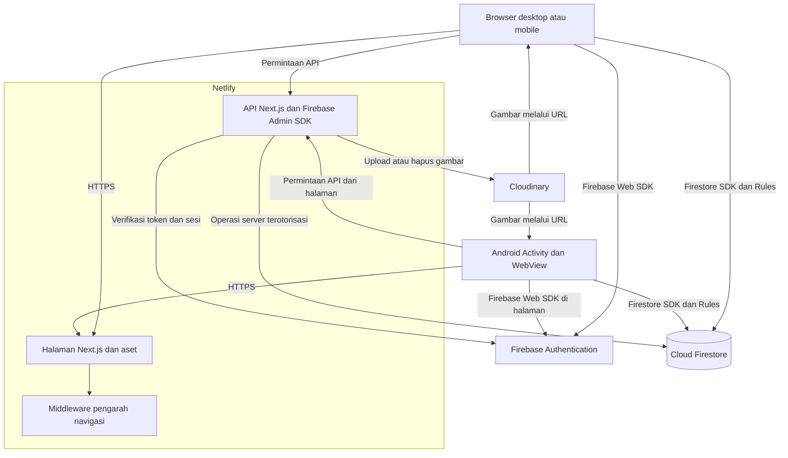
```mermaid
flowchart TB
    B[Browser desktop atau mobile]
    A[Android Activity dan WebView]
    subgraph N[Netlify]
        W[Halaman Next.js dan aset]
        M[Middleware pengarah navigasi]
        API[API Next.js dan Firebase Admin SDK]
    end
    FA[Firebase Authentication]
    DB[(Cloud Firestore)]
    CL[Cloudinary]
    B -->|HTTPS| W
    A -->|HTTPS| W
    W --> M
    B -->|Permintaan API| API
    A -->|Permintaan API dari halaman| API
    B -->|Firebase Web SDK| FA
    A -->|Firebase Web SDK di halaman| FA
    B -->|Firestore SDK dan Rules| DB
    A -->|Firestore SDK dan Rules| DB
    API -->|Verifikasi token dan sesi| FA
    API -->|Operasi server terotorisasi| DB
    API -->|Upload atau hapus gambar| CL
    CL -->|Gambar melalui URL| B
    CL -->|Gambar melalui URL| A
```

| Lapisan | Komponen | Peran |
|---|---|---|
| Presentasi | `app/`, `components/` | Halaman dan interaksi |
| State | `lib/store/` | State UI; keranjang memakai persistence lokal |
| Logika domain | `lib/firebase/`, `lib/utils/`, `lib/hooks/` | Pengajuan, verifikasi, query, transformasi data |
| Server | `app/api/`, `lib/server/` | Validasi, otorisasi, kredensial privat |
| Data | Firestore | Dokumen inventaris, pengguna, transaksi, dan catatan pendukung |
| Identitas | Firebase Authentication | Akun dan token |
| Media | Cloudinary | File gambar; URL disimpan dalam data aplikasi |
| Android | `android/` | WebView, kamera, pemilih file, ekspor, dan cetak |

Cookie server bernama `__session`, dengan durasi lima hari, `HttpOnly`, serta `Secure` dan `SameSite=Strict` pada production. Middleware memeriksa keberadaan/bentuk cookie sebagai pengarah navigasi. API tetap perlu memverifikasi identitas sesuai handler. Firebase Admin tidak tunduk pada rules klien, sehingga pemeriksaan role/status pada API tetap penting.

## 5. Cara kerja dan alur sistem

Urutan berikut menjelaskan alur layanan pengajuan dan verifikasi. Ketersediaan input pada antarmuka dijelaskan pada [panduan Teknisi](#teknisi), termasuk kendala input SPT saat ini.

1. Admin Gudang menyiapkan lokasi, katalog, dan barang fisik.
2. Barang diidentifikasi menggunakan serial number/tagging dan QR yang merujuk item.
3. Teknisi login, scan/pilih item, lalu menyusun keranjang.
4. Teknisi mengisi tujuan, keterangan, dan nomor SPT bila diwajibkan.
5. Sistem membuat transaksi `pending` dan reservasi `item_locks` per item.
6. Admin Gudang memeriksa pengajuan dan barang.
7. Persetujuan memperbarui transaksi menjadi `completed`, memperbarui item/stok terkait, dan melepas reservasi dalam transaksi Firestore.
8. Penolakan mengubah transaksi menjadi `rejected`, mencatat alasan, dan melepas reservasi tanpa mengubah stok/lokasi melalui jalur penolakan.
9. Hasil ditampilkan pada riwayat, dashboard, laporan, dan notifikasi yang tersedia.

### Jenis transaksi

| Jenis | Arti | Catatan |
|---|---|---|
| `OUT` | Barang keluar | Nomor SPT wajib pada pengajuan |
| `MOVE` | Pemindahan / Bawa | Nomor SPT wajib pada pengajuan |
| `RETURN` | Pengembalian | Persetujuan ke Gudang menambah stok gudang |
| `DAMAGE` | Lapor Kerusakan | Mengubah kondisi menjadi Rusak dan mencatat lokasi/keterangan kerusakan |
| `DISMANTLE` | Barang Masuk (Bekas Pembongkaran) | Barang bekas pemakaian/bongkaran dari site yang dibawa kembali ke Gudang Regional 6 / Base. Kondisi Bagus akan berstatus **Tersedia** di gudang setelah disetujui, Rusak berstatus **Rusak**, dan Tidak Diketahui berstatus **Perlu Pengecekan**. |
| `FOUND` | Barang Masuk (Ditemukan) | Barang temuan yang dibawa masuk kembali ke Gudang Regional 6 / Base. Kondisi Bagus akan berstatus **Tersedia** di gudang setelah disetujui, Rusak berstatus **Rusak**. |

Aplikasi mendukung alur penuh untuk **OUT**, **MOVE**, **RETURN**, **DAMAGE**, **DISMANTLE**, dan **FOUND** baik pada Scanner Teknisi maupun Scanner Admin Gudang. Khusus untuk DISMANTLE dan FOUND, alur ini berfungsi sebagai **Barang Masuk (Bekas / Temuan)**:
- **Dukungan Multi-Scan Cepat**: Scanner membaca banyak QR secara beruntun tanpa terhenti oleh popup modal per item.
- **Preset Kondisi & Lokasi Masuk**: Teknisi/Admin dapat menentukan kondisi awal (Bagus / Rusak / Cek Fisik) dan lokasi tujuan default (Gudang Regional 6 / Base).
- **Pengaturan Kondisi Interaktif Per Item**: Tiap item dalam daftar hasil scan atau keranjang dapat diubah kondisinya secara langsung (misal jika ada satu unit yang fisiknya rusak di antara beberapa unit bagus).
- **Approval Pengajuan**: Pengajuan teknisi tetap berstatus `pending` dan memerlukan persetujuan Admin Gudang sebelum status barang menjadi `Tersedia` di gudang untuk mencegah spam data.

`pending`, `completed`, dan `rejected` adalah **status transaksi**. Status barang fisik berbeda: `Tersedia`, `Digunakan`, `Rusak`, `Hilang`, `Maintenance`, atau `Perlu Pengecekan`. Atribut `cariFisik`, seperti `Sesuai` atau `Tidak Ditemukan`, juga merupakan kategori terpisah.

| Kelompok status | Nilai | Cara membacanya |
|---|---|---|
| Transaksi | `pending` | Pengajuan tersimpan dan menunggu verifikasi; belum berarti barang telah dipindahkan oleh sistem |
| Transaksi | `completed` | Transaksi selesai melalui persetujuan atau pemrosesan langsung Admin Gudang |
| Transaksi | `rejected` | Pengajuan ditolak; baca alasan dan buat pengajuan baru bila diperlukan |
| Barang | `Tersedia`, `Digunakan`, `Rusak`, `Hilang`, `Maintenance`, `Perlu Pengecekan` | Kondisi/status operasional unit saat ini |
| Cari Fisik | `Sesuai`, `Tidak Ditemukan`, `Outstanding`, `Mutasi Keluar` | Kategori hasil pemeriksaan fisik yang dicatat untuk unit |

### Contoh satu siklus pekerjaan

Contoh berikut memakai **Scan Gudang** dengan unit dan lokasi ilustrasi:

1. Admin Gudang mencatat BUC `SN-0001`, status **Tersedia**, lokasi **Gudang**, lalu memasang QR unit.
2. Admin Gudang membuka Scan Gudang, memilih **Serah / Bawa**, lalu memindai QR unit tersebut.
3. Petugas memilih penerima, mengisi nomor SPT dan tujuan **Site A**, lalu memeriksa daftar barang.
4. Setelah identitas dan pekerjaan sesuai, petugas menekan **Proses & Simpan**.
5. Transaksi diproses langsung menjadi **completed** dan status unit menjadi **Digunakan** dengan data pergerakan terkait.
6. Petugas memeriksa hasil pada Daftar Transaksi dan detail unit, lalu memakai laporan sesuai filter.

Pada jalur pengajuan teknisi, transaksi yang berhasil dikirim terlebih dahulu berstatus **pending** dan baru diselesaikan melalui verifikasi. Penolakan menghasilkan **rejected** beserta alasan. Kedua jalur memiliki tahap dan formulir yang berbeda.

### Konsistensi dan pengecualian alur

- Pengajuan teknisi memakai `submitCartApprovalRequest`; stok/lokasi tidak langsung diubah saat pengajuan dibuat.
- Reservasi per item mencegah pending ganda melalui helper tersebut.
- Atomicity berlaku **per item/transaksi Firestore**, bukan satu commit global untuk seluruh keranjang. Jika terjadi kegagalan sebagian, periksa riwayat sebelum mengirim ulang.
- Helper persetujuan/penolakan memeriksa status masih pending sebelum memprosesnya.
- Scan Admin Gudang memiliki jalur langsung melalui `submitAdminScanBatch` dan `submitCartTransaction` yang dapat mencatat `completed`. Jalur gudang bukan satu batch atomik untuk semua perubahan.
- `stokTotal` adalah jumlah katalog lintas lokasi; `stokGudang` adalah jumlah di gudang. Pada helper persetujuan, OUT/MOVE dari Gudang mengurangi stok gudang, RETURN ke Gudang menambah stok gudang, dan DAMAGE mengurangi kedua penghitung. Pembaruan katalog bergantung pada relasi item/katalog yang tersedia.
- Notifikasi dan audit bersifat best effort pada pemanggil terkait; kegagalannya tidak otomatis membatalkan transaksi yang telah tersimpan.

## 6. Diagram konteks

Sistem digambarkan sebagai satu proses utama dengan empat entitas pengguna serta layanan eksternal pendukung (Firebase Authentication dan Cloudinary).

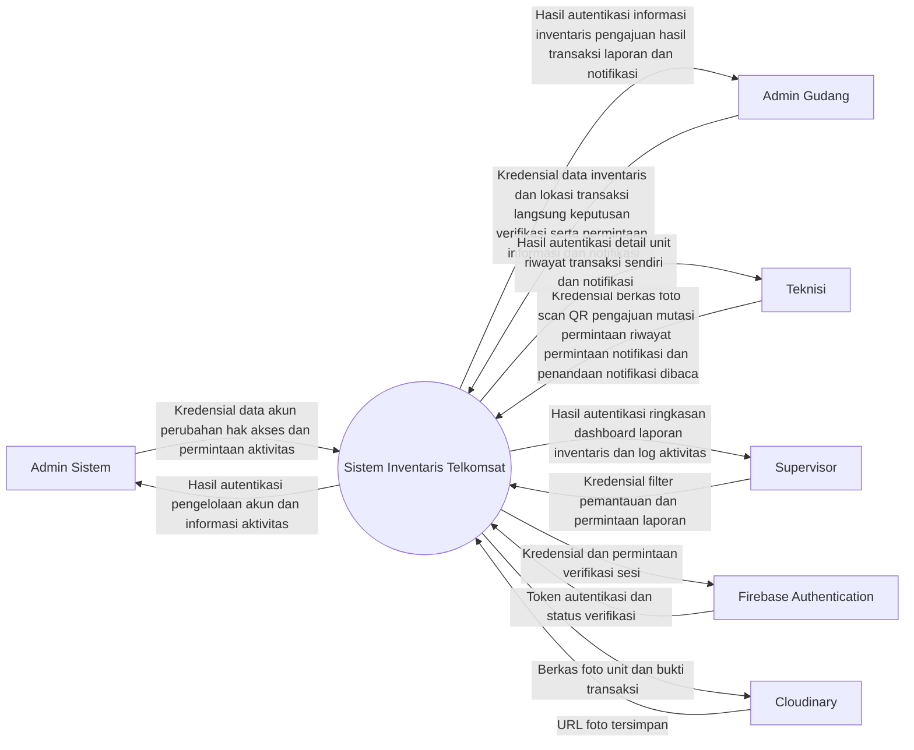
```mermaid
flowchart LR
    ADM[Admin Sistem] -->|Kredensial data akun perubahan hak akses dan permintaan aktivitas| SYS((Sistem Inventaris Telkomsat))
    SYS -->|Hasil autentikasi pengelolaan akun dan informasi aktivitas| ADM

    GD[Admin Gudang] -->|Kredensial data inventaris dan lokasi transaksi langsung keputusan verifikasi serta permintaan informasi dan notifikasi| SYS
    SYS -->|Hasil autentikasi informasi inventaris pengajuan hasil transaksi laporan dan notifikasi| GD

    TK[Teknisi] -->|Kredensial berkas foto scan QR pengajuan mutasi permintaan riwayat permintaan notifikasi dan penandaan notifikasi dibaca| SYS
    SYS -->|Hasil autentikasi detail unit riwayat transaksi sendiri dan notifikasi| TK

    SP[Supervisor] -->|Kredensial filter pemantauan dan permintaan laporan| SYS
    SYS -->|Hasil autentikasi ringkasan dashboard laporan inventaris dan log aktivitas| SP

    SYS -->|Kredensial dan permintaan verifikasi sesi| FA[Firebase Authentication]
    FA -->|Token autentikasi dan status verifikasi| SYS

    SYS -->|Berkas foto unit dan bukti transaksi| CL[Cloudinary]
    CL -->|URL foto tersimpan| SYS
```

## 7. DFD level 0

Konvensi dokumentasi ini: konteks adalah satu proses, DFD level 0 adalah proses utama, dan DFD level 1 merupakan rincian salah satu proses utama. Literatur lain kadang menyebut diagram konteks sebagai DFD level 0.

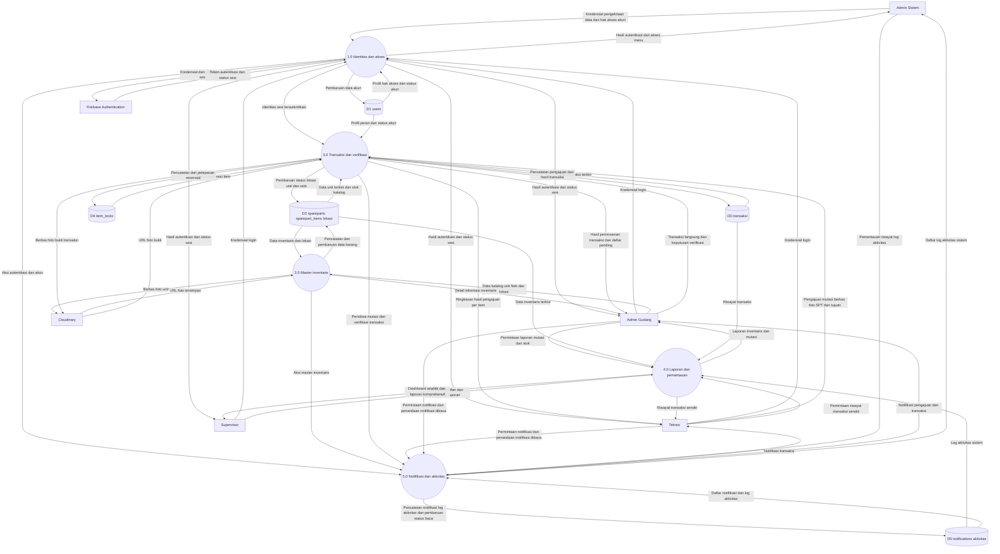
```mermaid
flowchart TB
    ADM[Admin Sistem]
    GD[Admin Gudang]
    TK[Teknisi]
    SP[Supervisor]

    P1((1.0 Identitas dan akses))
    P2((2.0 Master inventaris))
    P3((3.0 Transaksi dan verifikasi))
    P4((4.0 Laporan dan pemantauan))
    P5((5.0 Notifikasi dan aktivitas))

    D1[(D1 users)]
    D2[(D2 spareparts sparepart_items lokasi)]
    D3[(D3 transaksi)]
    D4[(D4 item_locks)]
    D5[(D5 notifications aktivitas)]

    FA[Firebase Authentication]
    CL[Cloudinary]

    %% 1.0 Identitas dan akses
    ADM -->|Kredensial pengelolaan data dan hak akses akun| P1
    GD -->|Kredensial login| P1
    TK -->|Kredensial login| P1
    SP -->|Kredensial login| P1
    P1 -->|Kredensial dan permintaan sesi| FA
    FA -->|Token autentikasi dan status sesi| P1
    D1 -->|Profil hak akses dan status akun| P1
    P1 -->|Pembaruan data akun| D1
    P1 -->|Hasil autentikasi dan akses menu| ADM
    P1 -->|Hasil autentikasi dan status sesi| GD
    P1 -->|Hasil autentikasi dan status sesi| TK
    P1 -->|Hasil autentikasi dan status sesi| SP

    %% 2.0 Master inventaris
    GD -->|Data katalog unit fisik dan lokasi| P2
    P2 -->|Berkas foto unit| CL
    CL -->|URL foto tersimpan| P2
    D2 -->|Data inventaris dan lokasi| P2
    P2 -->|Pencatatan dan pembaruan data barang| D2
    P2 -->|Detail informasi inventaris| GD

    %% 3.0 Transaksi dan verifikasi
    TK -->|Pengajuan mutasi berkas foto SPT dan tujuan| P3
    GD -->|Transaksi langsung dan keputusan verifikasi| P3
    P1 -->|Identitas sesi terautentikasi| P3
    D1 -->|Profil peran dan status akun| P3
    D2 -->|Data unit terkini dan stok katalog| P3
    P3 -->|Pembaruan status lokasi unit dan stok| D2
    D3 -->|Data transaksi terkini| P3
    P3 -->|Pencatatan pengajuan dan hasil transaksi| D3
    D4 -->|Status reservasi item| P3
    P3 -->|Pencatatan dan pelepasan reservasi| D4
    P3 -->|Berkas foto bukti transaksi| CL
    CL -->|URL foto bukti| P3
    P3 -->|Ringkasan hasil pengajuan per item| TK
    P3 -->|Hasil pemrosesan transaksi dan daftar pending| GD

    %% 4.0 Laporan dan pemantauan
    TK -->|Permintaan riwayat transaksi sendiri| P4
    GD -->|Permintaan laporan mutasi dan stok| P4
    SP -->|Parameter filter dan periode laporan| P4
    D2 -->|Data inventaris terkini| P4
    D3 -->|Riwayat transaksi| P4
    D5 -->|Log aktivitas sistem| P4
    P4 -->|Riwayat transaksi sendiri| TK
    P4 -->|Laporan inventaris dan mutasi| GD
    P4 -->|Dashboard analitik dan laporan komprehensif| SP

    %% 5.0 Notifikasi dan aktivitas
    P1 -->|Aksi autentikasi dan akun| P5
    P2 -->|Aksi master inventaris| P5
    P3 -->|Peristiwa mutasi dan verifikasi transaksi| P5
    D5 -->|Daftar notifikasi dan log aktivitas| P5
    P5 -->|Pencatatan notifikasi log aktivitas dan pembaruan status baca| D5
    TK -->|Permintaan notifikasi dan penandaan notifikasi dibaca| P5
    GD -->|Permintaan notifikasi dan penandaan notifikasi dibaca| P5
    ADM -->|Pemantauan riwayat log aktivitas| P5
    P5 -->|Notifikasi transaksi| TK
    P5 -->|Notifikasi pengajuan dan transaksi| GD
    P5 -->|Daftar log aktivitas sistem| ADM
```

## 8. DFD level 1

Rincian **proses 3.0: transaksi dan verifikasi**, memodelkan pemrosesan per item untuk pengajuan teknisi maupun transaksi langsung Admin Gudang. Aliran masuk/keluar mengacu pada entitas luar dan penyimpanan data yang selaras dengan DFD level 0.

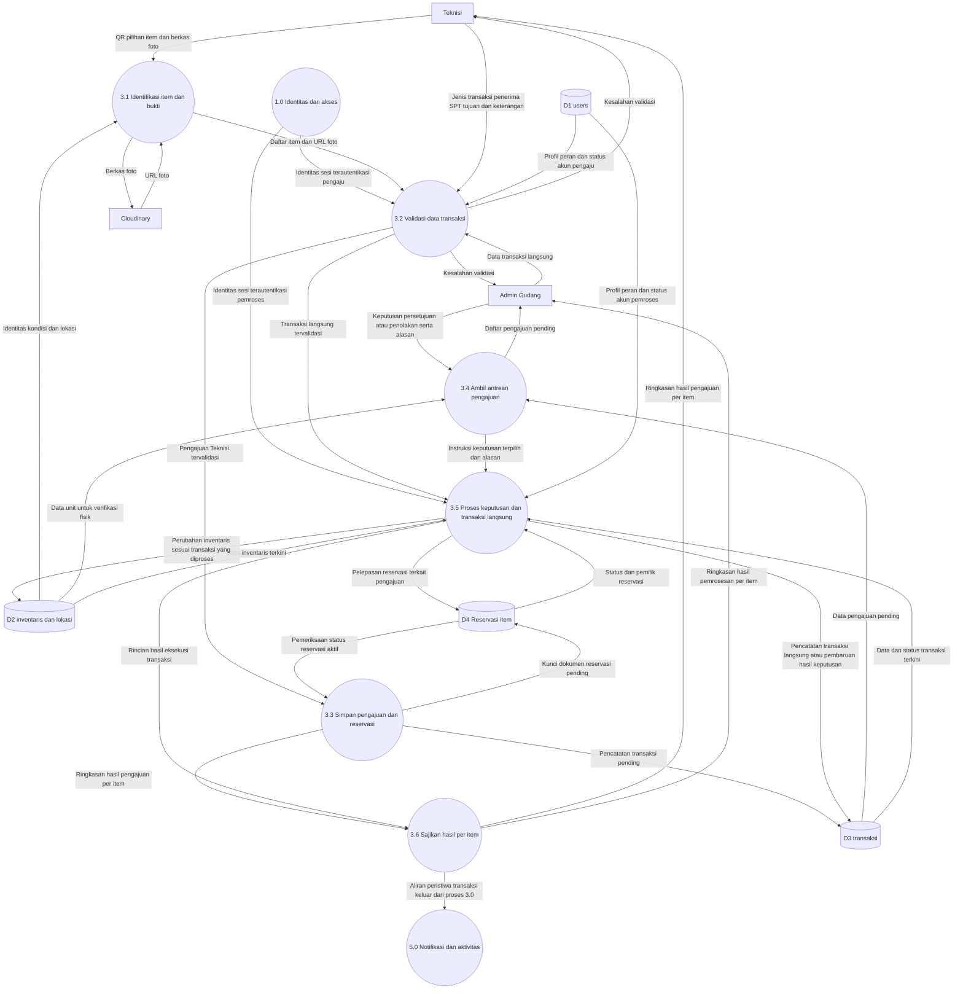
```mermaid
flowchart TB
    T[Teknisi]
    G[Admin Gudang]
    P1((1.0 Identitas dan akses))
    A((3.1 Identifikasi item dan bukti))
    B((3.2 Validasi data transaksi))
    C((3.3 Simpan pengajuan dan reservasi))
    D((3.4 Ambil antrean pengajuan))
    E((3.5 Proses keputusan dan transaksi langsung))
    F((3.6 Sajikan hasil per item))
    U[(D1 users)]
    I[(D2 inventaris dan lokasi)]
    TX[(D3 transaksi)]
    K[(D4 Reservasi item)]
    N((5.0 Notifikasi dan aktivitas))
    CL[Cloudinary]

    %% Identitas sesi dari proses 1.0 (sesuai DFD Level 0)
    P1 -->|Identitas sesi terautentikasi pengaju| B
    P1 -->|Identitas sesi terautentikasi pemroses| E

    %% 3.1 Identifikasi item dan bukti
    T -->|QR pilihan item dan berkas foto| A
    I -->|Identitas kondisi dan lokasi| A
    A -->|Berkas foto| CL
    CL -->|URL foto| A
    A -->|Daftar item dan URL foto| B

    %% 3.2 Validasi data transaksi
    T -->|Jenis transaksi penerima SPT tujuan dan keterangan| B
    G -->|Data transaksi langsung| B
    U -->|Profil peran dan status akun pengaju| B
    B -->|Kesalahan validasi| T
    B -->|Kesalahan validasi| G
    B -->|Pengajuan Teknisi tervalidasi| C
    B -->|Transaksi langsung tervalidasi| E

    %% 3.3 Simpan pengajuan dan reservasi (Khusus Pengajuan Teknisi)
    K -->|Pemeriksaan status reservasi aktif| C
    C -->|Pencatatan transaksi pending| TX
    C -->|Kunci dokumen reservasi pending| K
    C -->|Ringkasan hasil pengajuan per item| F

    %% 3.4 Ambil antrean pengajuan (Review Gudang)
    TX -->|Data pengajuan pending| D
    I -->|Data unit untuk verifikasi fisik| D
    D -->|Daftar pengajuan pending| G
    G -->|Keputusan persetujuan atau penolakan serta alasan| D
    D -->|Instruksi keputusan terpilih dan alasan| E

    %% 3.5 Proses keputusan dan transaksi langsung
    U -->|Profil peran dan status akun pemroses| E
    I -->|Data inventaris terkini| E
    K -->|Status dan pemilik reservasi| E
    TX -->|Data dan status transaksi terkini| E
    E -->|Pencatatan transaksi langsung atau pembaruan hasil keputusan| TX
    E -->|Perubahan inventaris sesuai transaksi yang diproses| I
    E -->|Pelepasan reservasi terkait pengajuan| K
    E -->|Rincian hasil eksekusi transaksi| F

    %% 3.6 Sajikan hasil per item dan peristiwa luar
    F -->|Ringkasan hasil pengajuan per item| T
    F -->|Ringkasan hasil pemrosesan per item| G
    F -->|Aliran peristiwa transaksi keluar dari proses 3.0| N
```

> **Catatan Aliran Data DFD Level 1:**
> - **Aliran Transaksi Langsung:** Admin Gudang memasukkan transaksi langsung ke proses `3.2 Validasi data transaksi`. Setelah divalidasi, aliran langsung menuju `3.5 Proses keputusan dan transaksi langsung` (mencatat transaksi `completed` dan memperbarui unit/katalog) tanpa melalui penyimpanan status `pending` pada proses `3.3`.
> - **Penyimpanan D4 Reservasi Item:** Berfokus pada pencegahan pengajuan ganda (`item_locks`). Keranjang belanja dikelola pada memori antarmuka (*client state*) dan dialirkan sebagai daftar item dari `3.1` ke `3.2` tanpa dicatat permanen ke basis data sebelum transaksi diajukan.
> - **Proses Eksternal 5.0:** `5.0 Notifikasi dan aktivitas` digambarkan sebagai proses penghubung luar lingkup proses 3.0 untuk mencatat riwayat audit log dan mengirim pemberitahuan sistem (selaras dengan DFD Level 0).
> - **Hasil Per Item:** Keluaran proses 3.6 disajikan sebagai ringkasan hasil per item ke Teknisi dan Admin Gudang, menegaskan pemrosesan per item/transaksi Firestore (bukan commit tunggal semua item).

## 9. ERD dan kamus data

Firestore adalah database dokumen. ERD menunjukkan **relasi logis**; FK bukan foreign key SQL yang otomatis ditegakkan database. ID dokumen ditampilkan sebagai `id` agar mudah dibaca.

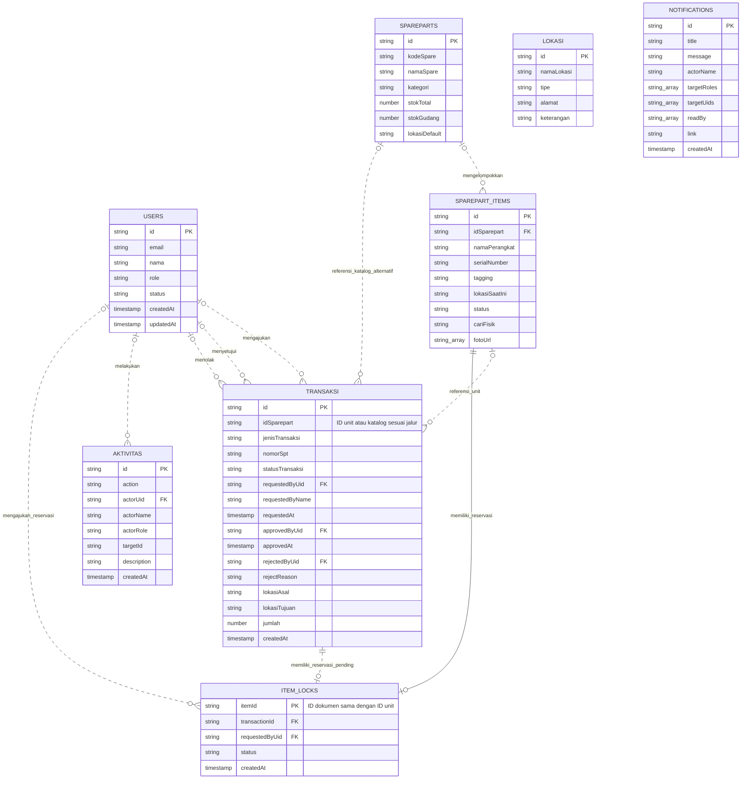
```mermaid
erDiagram
    USERS o|..o{ TRANSAKSI : mengajukan
    USERS o|..o{ TRANSAKSI : menyetujui
    USERS o|..o{ TRANSAKSI : menolak
    USERS o|..o{ AKTIVITAS : melakukan

    SPAREPARTS o|..o{ SPAREPART_ITEMS : mengelompokkan

    SPAREPART_ITEMS o|..o{ TRANSAKSI : referensi_unit
    SPAREPARTS o|..o{ TRANSAKSI : referensi_katalog_alternatif

    SPAREPART_ITEMS ||--o| ITEM_LOCKS : memiliki_reservasi
    TRANSAKSI ||..o| ITEM_LOCKS : memiliki_reservasi_pending
    USERS o|..o{ ITEM_LOCKS : mengajukan_reservasi

    USERS {
        string id PK
        string email
        string nama
        string role
        string status
        timestamp createdAt
        timestamp updatedAt
    }
    SPAREPARTS {
        string id PK
        string kodeSpare
        string namaSpare
        string kategori
        number stokTotal
        number stokGudang
        string lokasiDefault
    }
    SPAREPART_ITEMS {
        string id PK
        string idSparepart FK
        string namaPerangkat
        string serialNumber
        string tagging
        string lokasiSaatIni
        string status
        string cariFisik
        string_array fotoUrl
    }
    TRANSAKSI {
        string id PK
        string idSparepart "ID unit atau katalog sesuai jalur"
        string jenisTransaksi
        string nomorSpt
        string statusTransaksi
        string requestedByUid FK
        string requestedByName
        timestamp requestedAt
        string approvedByUid FK
        timestamp approvedAt
        string rejectedByUid FK
        string rejectReason
        string lokasiAsal
        string lokasiTujuan
        number jumlah
        timestamp createdAt
    }
    ITEM_LOCKS {
        string itemId PK "ID dokumen sama dengan ID unit"
        string transactionId FK
        string requestedByUid FK
        string status
        timestamp createdAt
    }
    LOKASI {
        string id PK
        string namaLokasi
        string tipe
        string alamat
        string keterangan
    }
    NOTIFICATIONS {
        string id PK
        string title
        string message
        string actorName
        string_array targetRoles
        string_array targetUids
        string_array readBy
        string link
        timestamp createdAt
    }
    AKTIVITAS {
        string id PK
        string action
        string actorUid FK
        string actorName
        string actorRole
        string targetId
        string description
        timestamp createdAt
    }
```

### Penjelasan relasi

> **Catatan:** Diagram menampilkan atribut utama dan hubungan logis antardokumen. Referensi transaksi menuju unit fisik atau katalog bersifat alternatif sesuai jalur pencatatan. ID dokumen tidak selalu disimpan kembali sebagai atribut. Hubungan antardokumen tidak menunjukkan penerapan batasan *foreign key* otomatis oleh Cloud Firestore.
> Garis putus-putus (`..`) menunjukkan hubungan *non-identifying* (entitas anak memiliki identitas/ID independen), sedangkan garis penuh (`--`) pada `ITEM_LOCKS` menunjukkan hubungan *identifying* karena ID dokumen reservasi sama persis dengan ID unit fisik.

- `users/{uid}` memakai UID Firebase Authentication. Password dikelola Authentication, bukan disimpan dalam dokumen pengguna.
- `sparepart_items.idSparepart` dapat kosong untuk unit tanpa katalog.
- `transaksi.idSparepart` menunjuk ke ID barang fisik (`sparepart_items`), dengan referensi katalog alternatif (`spareparts`) untuk alur non-SN/legacy. Dua relasi pada ERD adalah alternatif referensi logis, bukan dua FK wajib sekaligus.
- Lokasi pada item/transaksi disimpan sebagai string; tidak semuanya merupakan ID koleksi `lokasi`.
- `item_locks/{itemId}` merupakan reservasi pengajuan pending (ID dokumen sama dengan ID unit fisik), dilepas setelah keputusan (approval/rejection).
- Penerima notifikasi berupa array UID/role, bukan tabel penghubung relasional.
- Keranjang operasional pada aplikasi klien dikelola melalui local state browser (`useCartStore`); koleksi `session_keranjang` bersifat opsional/draft sehingga tidak disertakan dalam ERD inti skripsi.
- Model TypeScript umumnya memakai `Date`; Firestore memakai timestamp dan helper mengonversinya.

| Koleksi | Isi utama | Model |
|---|---|---|
| `users` | Profil, role, status | `User` |
| `spareparts` | Katalog dan stok | `Sparepart` |
| `sparepart_items` | Unit fisik, SN/tagging, foto, kondisi | `SparepartItem` |
| `lokasi` | Master lokasi | `Lokasi` |
| `transaksi` | Pengajuan dan keputusan | `Transaksi` |
| `item_locks` | Reservasi pending | Payload helper transaksi |
| `notifications` | Isi, target, pembaca | `AppNotification` |
| `aktivitas` | Aksi, aktor, target, waktu | `AuditLogItem` |
| `session_keranjang` | Draft keranjang (opsional) | `SessionKeranjang` |
| `session_keranjang_item` | Item draft keranjang (opsional) | `SessionKeranjangItem` |
| `teknisi_guest` | Koleksi legacy | Ditolak rules saat ini |

## 10. UML use case

Mermaid tidak menyediakan sintaks use case UML khusus. Diagram ini memakai flowchart dengan oval sebagai representasi use case dan aktor di luar batas sistem.

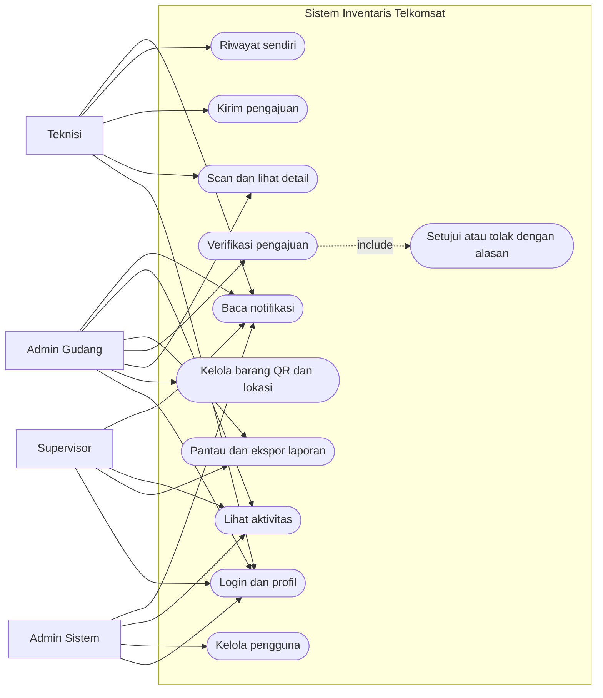
```mermaid
flowchart LR
    AS[Admin Sistem]
    AG[Admin Gudang]
    TE[Teknisi]
    SU[Supervisor]
    subgraph SYS[Sistem Inventaris Telkomsat]
        L([Login dan profil])
        U([Kelola pengguna])
        M([Kelola barang QR dan lokasi])
        S([Scan dan lihat detail])
        K([Kirim pengajuan])
        V([Verifikasi pengajuan])
        C([Setujui atau tolak dengan alasan])
        R([Riwayat sendiri])
        P([Pantau dan ekspor laporan])
        A([Lihat aktivitas])
        N([Baca notifikasi])
    end
    AS --> L
    AG --> L
    TE --> L
    SU --> L
    AS --> U
    AS --> A
    AS --> N
    AG --> M
    AG --> S
    AG --> V
    AG --> P
    AG --> A
    AG --> N
    TE --> S
    TE --> K
    TE --> R
    TE --> N
    SU --> P
    SU --> A
    SU --> N
    V -.->|include| C
```

| Use case | Prasyarat | Hasil |
|---|---|---|
| Login | Akun Auth dan profil tersedia | Sesi dan state pengguna |
| Kelola pengguna | Admin Sistem aktif | Akun/profil diperbarui melalui API |
| Kelola inventaris | Admin Gudang | Master tersimpan |
| Pengajuan | Teknisi login dan input valid | Pending dan reservasi |
| Verifikasi | Admin Gudang dan transaksi pending | Completed/rejected dengan identitas verifikator |
| Laporan | Role mempunyai akses | Ringkasan/dokumen sesuai filter |

## 11. UML class diagram

Source terutama memakai interface TypeScript dan fungsi. Kotak layanan adalah pengelompokan konseptual fungsi, bukan klaim adanya class OOP dengan nama tersebut pada source.

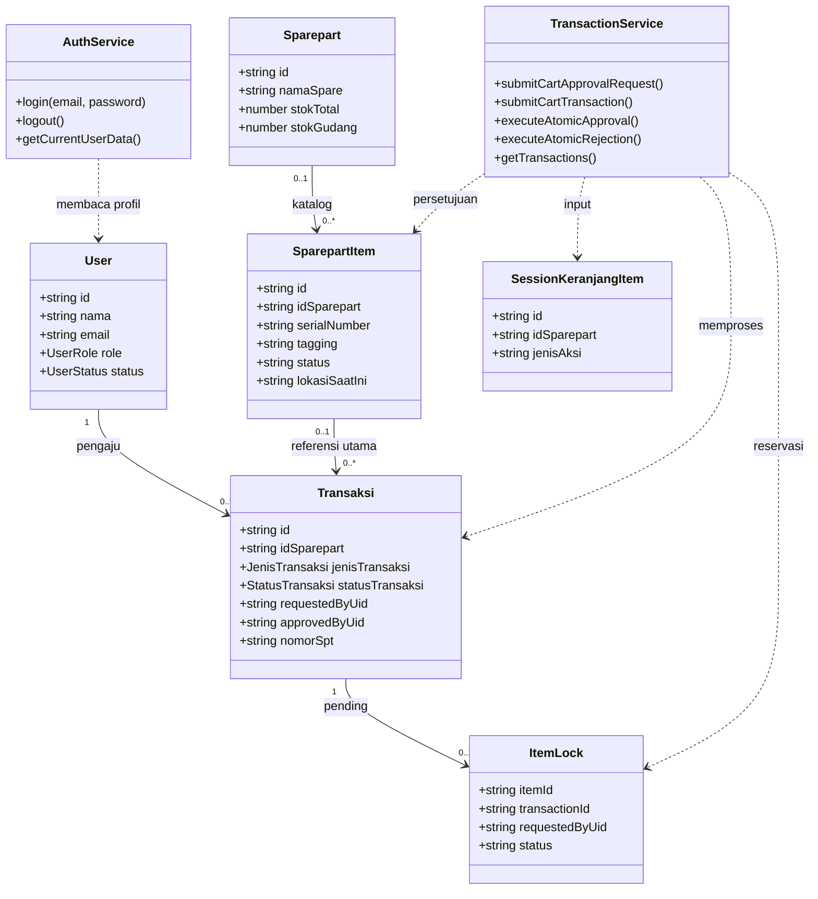
```mermaid
classDiagram
    class User {
        +string id
        +string nama
        +string email
        +UserRole role
        +UserStatus status
    }
    class Sparepart {
        +string id
        +string namaSpare
        +number stokTotal
        +number stokGudang
    }
    class SparepartItem {
        +string id
        +string idSparepart
        +string serialNumber
        +string tagging
        +string status
        +string lokasiSaatIni
    }
    class Transaksi {
        +string id
        +string idSparepart
        +JenisTransaksi jenisTransaksi
        +StatusTransaksi statusTransaksi
        +string requestedByUid
        +string approvedByUid
        +string nomorSpt
    }
    class ItemLock {
        +string itemId
        +string transactionId
        +string requestedByUid
        +string status
    }
    class SessionKeranjangItem {
        +string id
        +string idSparepart
        +string jenisAksi
    }
    class AuthService {
        +login(email, password)
        +logout()
        +getCurrentUserData()
    }
    class TransactionService {
        +submitCartApprovalRequest()
        +submitCartTransaction()
        +executeAtomicApproval()
        +executeAtomicRejection()
        +getTransactions()
    }
    User "1" --> "0..*" Transaksi : pengaju
    Sparepart "0..1" --> "0..*" SparepartItem : katalog
    SparepartItem "0..1" --> "0..*" Transaksi : referensi utama
    Transaksi "1" --> "0..1" ItemLock : pending
    AuthService ..> User : membaca profil
    TransactionService ..> SessionKeranjangItem : input
    TransactionService ..> Transaksi : memproses
    TransactionService ..> ItemLock : reservasi
    TransactionService ..> SparepartItem : persetujuan
```

## 12. UML sequence diagram

### A. Login dan sesi server

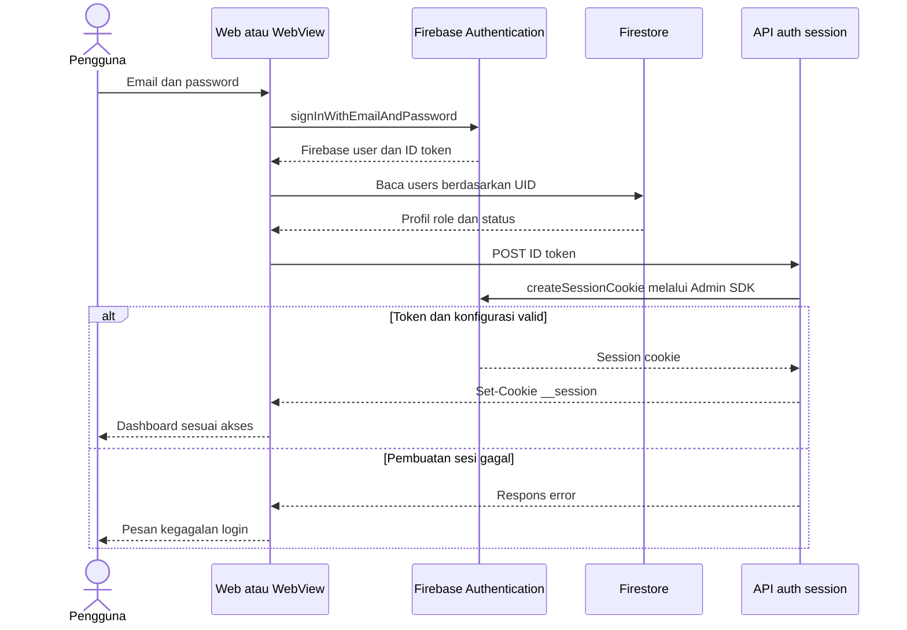
```mermaid
sequenceDiagram
    actor U as Pengguna
    participant W as Web atau WebView
    participant FA as Firebase Authentication
    participant DB as Firestore
    participant API as API auth session
    U->>W: Email dan password
    W->>FA: signInWithEmailAndPassword
    FA-->>W: Firebase user dan ID token
    W->>DB: Baca users berdasarkan UID
    DB-->>W: Profil role dan status
    W->>API: POST ID token
    API->>FA: createSessionCookie melalui Admin SDK
    alt Token dan konfigurasi valid
        FA-->>API: Session cookie
        API-->>W: Set-Cookie __session
        W-->>U: Dashboard sesuai akses
    else Pembuatan sesi gagal
        API-->>W: Respons error
        W-->>U: Pesan kegagalan login
    end
```

Diagram menunjukkan alur logis. `AuthProvider` juga mendengarkan perubahan autentikasi dan menyinkronkan sesi, sehingga implementasi dapat mengirim permintaan sesi tambahan.

### B. Pengajuan dan persetujuan

```mermaid
sequenceDiagram
    actor T as Teknisi
    participant UI as Antarmuka dan helper transaksi
    participant DB as Firestore dan Rules
    actor G as Admin Gudang
    T->>UI: Scan dan isi keranjang tujuan SPT
    UI->>UI: Validasi input dan UID
    loop Setiap item
        UI->>DB: runTransaction baca lock dan item
        alt Belum ada pending aktif
            UI->>DB: Simpan pending dan item_lock
            DB-->>UI: Commit berhasil
        else Sudah direservasi
            DB-->>UI: Pengajuan item ditolak
        end
    end
    UI-->>T: Hasil pengajuan
    G->>UI: Buka daftar verifikasi
    UI->>DB: Baca transaksi pending
    DB-->>UI: Daftar pengajuan
    G->>UI: Setujui transaksi
    UI->>DB: runTransaction baca status dan inventaris
    alt Status masih pending
        UI->>DB: Update item stok dan completed; hapus lock
        DB-->>UI: Commit berhasil
        UI-->>G: Verifikasi selesai
    else Sudah diproses
        DB-->>UI: Tolak pemrosesan ulang
    end
    T->>UI: Buka riwayat sendiri
    UI->>DB: Baca transaksi milik UID
    DB-->>UI: Status terbaru
    UI-->>T: Tampilkan hasil
```

### C. Upload foto

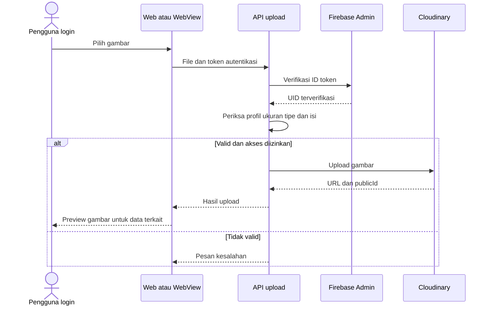
```mermaid
sequenceDiagram
    actor U as Pengguna login
    participant W as Web atau WebView
    participant API as API upload
    participant FA as Firebase Admin
    participant C as Cloudinary
    U->>W: Pilih gambar
    W->>API: File dan token autentikasi
    API->>FA: Verifikasi ID token
    FA-->>API: UID terverifikasi
    API->>API: Periksa profil ukuran tipe dan isi
    alt Valid dan akses diizinkan
        API->>C: Upload gambar
        C-->>API: URL dan publicId
        API-->>W: Hasil upload
        W-->>U: Preview gambar untuk data terkait
    else Tidak valid
        API-->>W: Pesan kesalahan
    end
```

## 13. UML activity diagram, flowchart, dan state diagram

Diagram aktivitas (Activity Diagram) memodelkan alur kerja sistem operasional (*workflow*) menggunakan partisi (*swimlanes*) yang memisahkan tanggung jawab antara pengguna/aktor, antarmuka sistem (Web & Android), dan basis data Firestore beserta layanan pendukungnya.

> **Catatan Notasi:** Diagram menggunakan sintaks `flowchart TD` dengan pengelompokan `subgraph` untuk memvisualisasikan partisi tanggung jawab (*activity partitions / swimlanes*) secara terstruktur dan terbaca langsung pada repositori. Garis penuh (`-->`) menunjukkan urutan alur kegiatan antartindakan, sedangkan garis putus-putus (`-.->`) menunjukkan hubungan penulisan atau penyimpanan data ke basis data.

### A. Activity diagram alur sistem (Project Overview)

Diagram ini menggambarkan alur kerja global seluruh modul aplikasi Telkomsat dari proses autentikasi terpusat hingga pembagian jalur operasional mandiri sesuai peran pengguna (*role-based access*).

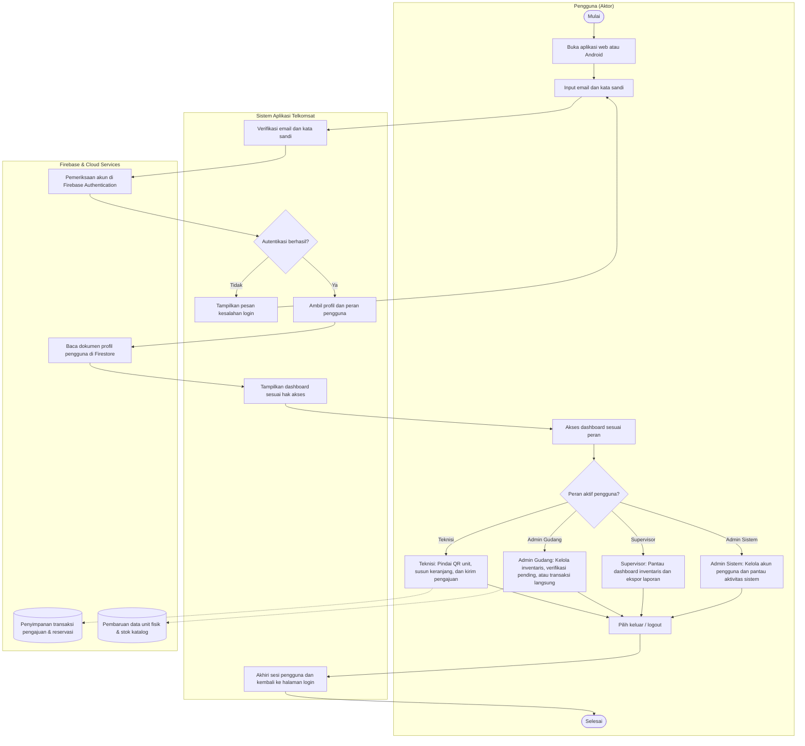
```mermaid
flowchart TD
    subgraph USR["Pengguna (Aktor)"]
        U_START([Mulai]) --> U_OPEN[Buka aplikasi web atau Android]
        U_OPEN --> U_LOGIN[Input email dan kata sandi]
        U_DASH[Akses dashboard sesuai peran]
        
        %% Percabangan alur mandiri per peran dengan simpul keputusan
        U_DASH --> U_ROLE{Peran aktif pengguna?}
        U_ROLE -->|Teknisi| T_PATH[Teknisi: Pindai QR unit, susun keranjang, dan kirim pengajuan]
        U_ROLE -->|Admin Gudang| G_PATH[Admin Gudang: Kelola inventaris, verifikasi pending, atau transaksi langsung]
        U_ROLE -->|Supervisor| S_PATH[Supervisor: Pantau dashboard inventaris dan ekspor laporan]
        U_ROLE -->|Admin Sistem| A_PATH[Admin Sistem: Kelola akun pengguna dan pantau aktivitas sistem]
        
        T_PATH --> U_LOGOUT[Pilih keluar / logout]
        G_PATH --> U_LOGOUT
        S_PATH --> U_LOGOUT
        A_PATH --> U_LOGOUT
        U_END([Selesai])
    end

    subgraph SYS["Sistem Aplikasi Telkomsat"]
        U_LOGIN --> S_VERIFY[Verifikasi email dan kata sandi]
        S_CHECK{Autentikasi berhasil?}
        S_CHECK -->|Tidak| S_ERR[Tampilkan pesan kesalahan login]
        S_ERR --> U_LOGIN
        S_CHECK -->|Ya| S_FETCH[Ambil profil dan peran pengguna]
        S_ROUTE[Tampilkan dashboard sesuai hak akses] --> U_DASH
        
        U_LOGOUT --> S_LOGOUT[Akhiri sesi pengguna dan kembali ke halaman login]
        S_LOGOUT --> U_END
    end

    subgraph CLD["Firebase & Cloud Services"]
        S_VERIFY --> C_AUTH[Pemeriksaan akun di Firebase Authentication]
        C_AUTH --> S_CHECK
        S_FETCH --> C_USER[Baca dokumen profil pengguna di Firestore]
        C_USER --> S_ROUTE
        T_PATH -.-> C_TX[(Penyimpanan transaksi pengajuan & reservasi)]
        G_PATH -.-> C_STOCK[(Pembaruan data unit fisik & stok katalog)]
    end
```

> **Catatan Alur:** Pengguna menjalankan cabang operasional sesuai peran aktif dan hak aksesnya. Pencatatan pengajuan tidak langsung mengubah stok. Pembaruan data unit dan penyesuaian stok dilakukan pada proses yang berhasil menerapkan perubahan inventaris sesuai aturan transaksi.

### B. Activity diagram pengajuan dan verifikasi transaksi

Diagram ini memodelkan siklus transaksi mutasi atau kerusakan unit barang yang diajukan oleh Teknisi dan diverifikasi oleh Admin Gudang, dilengkapi mekanisme penguncian unit (*reservation lock*) untuk mencegah pengajuan ganda secara bersamaan.

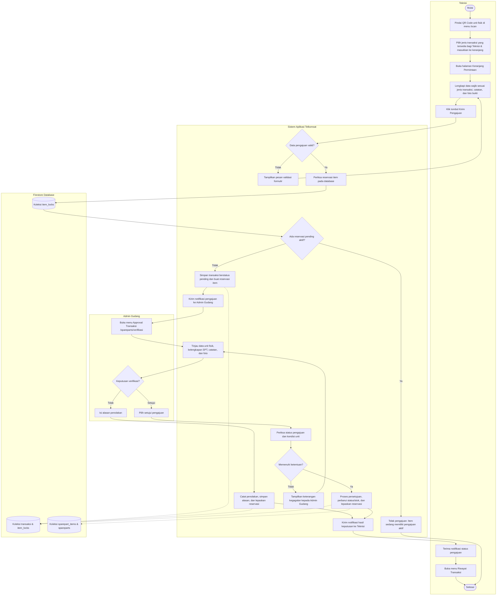
```mermaid
flowchart TD
    subgraph TEK["Teknisi"]
        T_START([Mulai]) --> T_SCAN[Pindai QR Code unit fisik di menu /scan]
        T_SCAN --> T_ADD[Pilih jenis transaksi yang tersedia bagi Teknisi & masukkan ke keranjang]
        T_ADD --> T_CART[Buka halaman Keranjang Permintaan]
        T_CART --> T_FORM[Lengkapi data wajib sesuai jenis transaksi, catatan, dan foto bukti]
        T_FORM --> T_SUBMIT[Klik tombol Kirim Pengajuan]
        T_NOTIF[Terima notifikasi status pengajuan] --> T_HIST[Buka menu Riwayat Transaksi]
        T_HIST --> T_END([Selesai])
    end

    subgraph SYS["Sistem Aplikasi Telkomsat"]
        T_SUBMIT --> S_VAL{Data pengajuan valid?}
        S_VAL -->|Tidak| S_ERR_FORM[Tampilkan pesan validasi formulir]
        S_ERR_FORM --> T_FORM
        S_VAL -->|Ya| S_LOCK_CHK[Periksa reservasi item pada database]
        
        S_IS_LOCKED{Ada reservasi pending aktif?}
        S_IS_LOCKED -->|Ya| S_ERR_LOCK[Tolak pengajuan: Item sedang memiliki pengajuan aktif]
        S_ERR_LOCK --> T_END
        S_IS_LOCKED -->|Tidak| S_CREATE_TX[Simpan transaksi berstatus pending dan buat reservasi item]
        
        S_CREATE_TX --> S_NOTIF_ADM[Kirim notifikasi pengajuan ke Admin Gudang]
        
        S_REJECT[Catat penolakan, simpan alasan, dan lepaskan reservasi]
        
        S_CHK_UNIT[Periksa status pengajuan dan kondisi unit]
        S_CHK_UNIT --> S_ELIGIBLE{Memenuhi ketentuan?}
        S_ELIGIBLE -->|Ya| S_APPROVE[Proses persetujuan, perbarui status/stok, dan lepaskan reservasi]
        S_ELIGIBLE -->|Tidak| S_FAIL[Tampilkan keterangan kegagalan kepada Admin Gudang]
        S_FAIL --> G_REVIEW
        
        S_REJECT --> S_NOTIF_TEK[Kirim notifikasi hasil keputusan ke Teknisi]
        S_APPROVE --> S_NOTIF_TEK
        S_NOTIF_TEK --> T_NOTIF
    end

    subgraph DB["Firestore Database"]
        S_LOCK_CHK --> D_LOCK[(Koleksi item_locks)]
        D_LOCK --> S_IS_LOCKED
        S_CREATE_TX -.-> D_TX[(Koleksi transaksi & item_locks)]
        S_REJECT -.-> D_TX
        S_APPROVE -.-> D_ITEMS[(Koleksi sparepart_items & spareparts)]
        S_APPROVE -.-> D_TX
    end

    subgraph ADM["Admin Gudang"]
        S_NOTIF_ADM --> G_OPEN[Buka menu Approval Transaksi /spareparts/verifikasi]
        G_OPEN --> G_REVIEW[Tinjau data unit fisik, kelengkapan SPT, catatan, dan foto]
        G_REVIEW --> G_DECIDE{Keputusan verifikasi?}
        G_DECIDE -->|Tolak| G_INPUT_REASON[Isi alasan penolakan]
        G_INPUT_REASON --> S_REJECT
        G_DECIDE -->|Setujui| G_APPROVE_ACT[Pilih setujui pengajuan]
        G_APPROVE_ACT --> S_CHK_UNIT
    end
```

> **Catatan Ruang Lingkup & Atomisitas:** Alur pemrosesan setelah pengiriman pengajuan ditampilkan untuk satu unit barang. Pemeriksaan reservasi dan pembuatan transaksi pending dilaksanakan dalam satu transaksi basis data atomik per unit (`runTransaction`) untuk mencegah konflik konkurensi (*race condition*). Pada persetujuan yang berhasil, sistem mengubah `statusTransaksi` menjadi `completed`, memperbarui data unit pada `sparepart_items`, menyesuaikan jumlah stok pada `spareparts` apabila diperlukan sesuai aturan jenis transaksi, serta melepaskan reservasi pada `item_locks`. Pada penolakan yang berhasil, sistem mencatat status `rejected` beserta alasannya dan melepaskan reservasi tanpa menerapkan perubahan barang maupun stok yang diajukan.

### C. Activity diagram transaksi langsung Admin Gudang

Diagram ini menggambarkan pemrosesan tindakan inventaris secara langsung oleh Admin Gudang, meliputi penyerahan, kerusakan, penerimaan, dan pembaruan data. Transaksi yang berhasil diproses dicatat sebagai selesai tanpa melalui tahap pengajuan dan persetujuan terpisah. Dokumen dibuat sesuai kebutuhan tindakan.

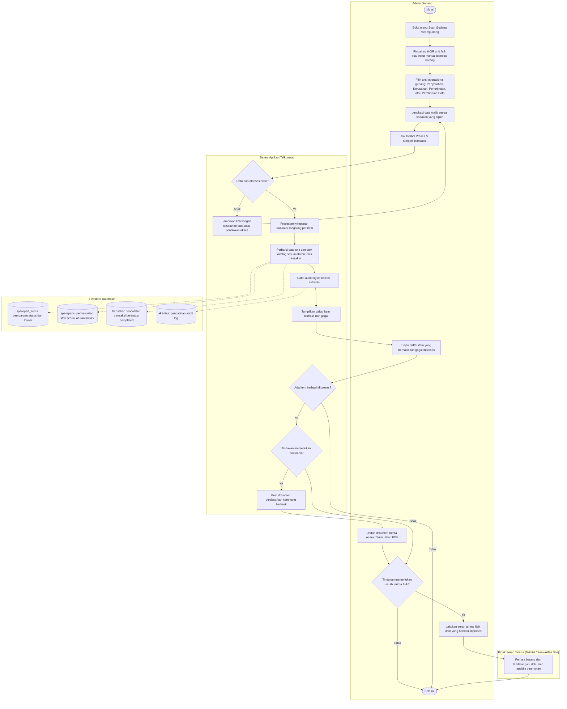
```mermaid
flowchart TD
    subgraph ADM["Admin Gudang"]
        A_START([Mulai]) --> A_OPEN[Buka menu Scan Gudang /scan/gudang]
        A_OPEN --> A_SCAN[Pindai multi-QR unit fisik atau input manual identitas barang]
        A_SCAN --> A_MODE[Pilih aksi operasional gudang: Penyerahan, Kerusakan, Penerimaan, atau Pembaruan Data]
        A_MODE --> A_INPUT[Lengkapi data wajib sesuai tindakan yang dipilih]
        A_INPUT --> A_SUBMIT[Klik tombol Proses & Simpan Transaksi]
        
        A_RESULT[Tinjau daftar item yang berhasil dan gagal diproses]
        A_PDF[Unduh dokumen Berita Acara / Surat Jalan PDF]
        A_PDF --> A_IS_HANDOVER{Tindakan memerlukan serah terima fisik?}
        A_IS_HANDOVER -->|Ya| A_HANDOVER[Lakukan serah terima fisik item yang berhasil diproses]
        A_IS_HANDOVER -->|Tidak| END_PROC([Selesai])
    end

    subgraph SYS["Sistem Aplikasi Telkomsat"]
        A_SUBMIT --> S_VAL{Data dan otorisasi valid?}
        S_VAL -->|Tidak| S_ERR[Tampilkan keterangan kesalahan data atau penolakan akses]
        S_ERR --> A_INPUT
        S_VAL -->|Ya| S_BATCH[Proses penyimpanan transaksi langsung per item]
        
        S_BATCH --> S_DB_WRITE[Perbarui data unit dan stok katalog sesuai aturan jenis transaksi]
        S_DB_WRITE --> S_AUDIT[Catat audit log ke koleksi aktivitas]
        S_AUDIT --> S_REPORT[Tampilkan daftar item berhasil dan gagal]
        S_REPORT --> A_RESULT
        
        A_RESULT --> S_HAS_SUCCESS{Ada item berhasil diproses?}
        S_HAS_SUCCESS -->|Tidak| END_PROC
        S_HAS_SUCCESS -->|Ya| S_CHK_DOC{Tindakan memerlukan dokumen?}
        S_CHK_DOC -->|Ya| S_GEN_DOC[Buat dokumen berdasarkan item yang berhasil]
        S_GEN_DOC --> A_PDF
        S_CHK_DOC -->|Tidak| A_IS_HANDOVER
    end

    subgraph DB["Firestore Database"]
        S_DB_WRITE -.-> D_ITEMS[(sparepart_items: pembaruan status dan lokasi)]
        S_DB_WRITE -.-> D_SP[(spareparts: penyesuaian stok sesuai aturan mutasi)]
        S_DB_WRITE -.-> D_TX[(transaksi: pencatatan transaksi berstatus completed)]
        S_AUDIT -.-> D_LOG[(aktivitas: pencatatan audit log)]
    end

    subgraph REC["Pihak Serah Terima (Teknisi / Perwakilan Site)"]
        A_HANDOVER --> R_RECV[Periksa barang dan tandatangani dokumen apabila diperlukan]
        R_RECV --> END_PROC
    end
```

> **Catatan:** Pemrosesan dilakukan per unit barang. Transaksi yang berhasil dicatat dengan status `completed`. Perubahan lokasi, kondisi unit, dan jumlah stok mengikuti aturan tindakan serta keadaan unit sebelum dan sesudah pemrosesan. Sistem menampilkan hasil pemrosesan masing-masing unit. Dokumen dan serah terima fisik hanya dilakukan apabila diperlukan.

### D. Flowchart teknisi

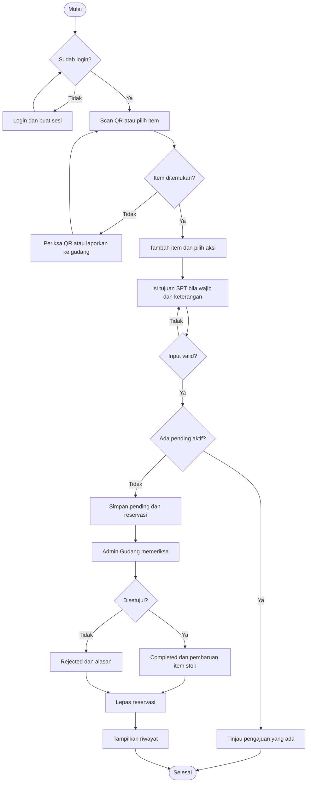
```mermaid
flowchart TD
    START([Mulai]) --> LOGIN{Sudah login?}
    LOGIN -->|Tidak| AUTH[Login dan buat sesi]
    AUTH --> LOGIN
    LOGIN -->|Ya| SCAN[Scan QR atau pilih item]
    SCAN --> EXISTS{Item ditemukan?}
    EXISTS -->|Tidak| FIX[Periksa QR atau laporkan ke gudang]
    FIX --> SCAN
    EXISTS -->|Ya| CART[Tambah item dan pilih aksi]
    CART --> FORM[Isi tujuan SPT bila wajib dan keterangan]
    FORM --> VALID{Input valid?}
    VALID -->|Tidak| FORM
    VALID -->|Ya| LOCK{Ada pending aktif?}
    LOCK -->|Ya| WAIT[Tinjau pengajuan yang ada]
    WAIT --> FINISH([Selesai])
    LOCK -->|Tidak| SUBMIT[Simpan pending dan reservasi]
    SUBMIT --> REVIEW[Admin Gudang memeriksa]
    REVIEW --> DECISION{Disetujui?}
    DECISION -->|Ya| OK[Completed dan pembaruan item stok]
    DECISION -->|Tidak| NO[Rejected dan alasan]
    OK --> RELEASE[Lepas reservasi]
    NO --> RELEASE
    RELEASE --> HISTORY[Tampilkan riwayat]
    HISTORY --> FINISH
```

### State diagram transaksi

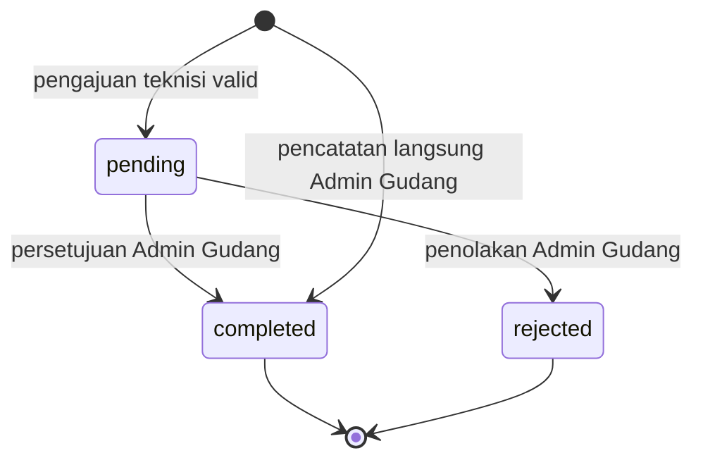
```mermaid
stateDiagram-v2
    [*] --> pending: pengajuan teknisi valid
    pending --> completed: persetujuan Admin Gudang
    pending --> rejected: penolakan Admin Gudang
    [*] --> completed: pencatatan langsung Admin Gudang
    completed --> [*]
    rejected --> [*]
```

Dokumen pending diperbarui menjadi completed/rejected. Helper verifikasi menolak pemrosesan ulang dokumen final. Pengajuan setelah penolakan merupakan transaksi baru, bukan mengubah rejected kembali ke pending.

## 14. Struktur proyek, halaman, dan API

```text
Telkomsatt/
├── app/                    Halaman App Router dan API Next.js
│   ├── api/                Sesi, pengguna, profil, dan upload
│   ├── dashboard/          Ringkasan sesuai role
│   ├── scan/               Teknisi dan scan/gudang
│   ├── spareparts/         Inventaris, impor, edit, verifikasi
│   └── transaksi/          Keranjang, daftar, detail
├── components/             Komponen bersama dan per role
├── lib/
│   ├── firebase/           Helper data dan transaksi
│   ├── server/             Firebase Admin dan utilitas API
│   ├── store/              Zustand
│   ├── pdf/                Generator dokumen
│   ├── hooks/              Hook laporan
│   ├── constants/          Konstanta domain dan storage
│   ├── utils/              Excel, OCR, format data
│   └── rbac.ts             Izin dan path
├── types/index.ts          Model domain
├── public/logo/            Gambar
├── scripts/                Seed dan pemeriksaan
├── android/                Proyek Android Studio
├── docs/                   Panduan pendukung
├── firestore.rules         Aturan database klien
├── firestore.indexes.json  Index Firestore
├── firebase.json           Konfigurasi Firebase
├── middleware.ts           Pengarah navigasi sesi
├── netlify.toml            Build Netlify
└── .env.example            Contoh konfigurasi
```

| Path | Kegunaan |
|---|---|
| `/`, `/login` | Portal dan login |
| `/dashboard` | Dashboard |
| `/spareparts`, `/spareparts/[id]` | Daftar dan detail inventaris |
| `/spareparts/tambah`, `/spareparts/[id]/edit` | Kelola barang |
| `/spareparts/export-import`, `/spareparts/import-foto` | Impor/ekspor dan foto |
| `/spareparts/verifikasi` | Verifikasi |
| `/item/[id]` | Detail unit fisik |
| `/scan`, `/scan/[id]`, `/scan/gudang` | Pemindaian |
| `/transaksi`, `/transaksi/[id]`, `/transaksi/keranjang` | Daftar, detail, pengajuan |
| `/teknisi/riwayat` | Riwayat teknisi |
| `/laporan`, `/aktivitas`, `/notifikasi` | Laporan, audit, pemberitahuan |
| `/lokasi` | Master lokasi |
| `/users`, `/users/tambah`, `/users/[id]/edit` | Pengguna |
| `/profile` | Profil |

| Endpoint | Metode | Fungsi |
|---|---|---|
| `/api/auth/session` | POST | Menukar ID token dengan cookie |
| `/api/auth/session` | GET | Memeriksa cookie sesi |
| `/api/auth/session` | DELETE | Menghapus cookie |
| `/api/admin/users` | POST, PATCH, PUT, DELETE | Operasi administratif sesuai handler/otorisasi |
| `/api/profile` | PATCH | Perubahan profil terautentikasi |
| `/api/upload` | POST, DELETE | Upload/hapus gambar sesuai validasi dan akses |

GET `/api/admin/users` tidak menyediakan daftar publik dan ditolak handler. Modul inventaris membaca Firestore melalui helper. Batas upload API adalah 5 MB per gambar, selain validasi format/isi dan batas hosting.

## 15. Instalasi dan konfigurasi

### A. Source lokal

| Prasyarat | Kegunaan |
|---|---|
| Git | Mengambil dan memperbarui source |
| Node.js 22 dan npm | Menyamai runtime build Netlify dan memasang dependency dari lockfile |
| Proyek Firebase | Authentication Email/Password, Firestore, konfigurasi aplikasi Web, dan service account server |
| Akun Cloudinary | Menyimpan gambar melalui API server |
| Browser dengan izin kamera | Menguji scanner; gunakan localhost atau HTTPS |
| Firebase CLI | Diperlukan jika menerapkan rules/index melalui terminal |

Android Studio hanya diperlukan untuk membangun atau menjalankan proyek Android. Jalankan perintah web dari root repository, yaitu folder yang berisi `package.json`.

```bash
git clone https://github.com/Fadliyuu/Telkomsatt.git
cd Telkomsatt
npm ci
```

Buat `.env.local` dari `.env.example` jika belum tersedia. Jangan menimpa konfigurasi yang sudah terisi. `.env.local` diabaikan Git dan tidak tersedia otomatis setelah clone.

PowerShell (Windows):

```powershell
if (-not (Test-Path -LiteralPath .env.local)) {
    Copy-Item -LiteralPath .env.example -Destination .env.local
}
```

Bash (Linux/macOS):

```bash
if [ ! -f .env.local ]; then
  cp .env.example .env.local
fi
```

Lengkapi konfigurasi pada langkah B–E sebelum mencoba login. Halaman yang berhasil terbuka belum membuktikan sesi server dan izin database telah dikonfigurasi.

### B. Firebase web: enam variabel

Ambil objek konfigurasi aplikasi Web dari pengaturan proyek Firebase. Pemetaan field:

| Environment | Properti Firebase Web |
|---|---|
| `NEXT_PUBLIC_FIREBASE_API_KEY` | `apiKey` |
| `NEXT_PUBLIC_FIREBASE_AUTH_DOMAIN` | `authDomain` |
| `NEXT_PUBLIC_FIREBASE_PROJECT_ID` | `projectId` |
| `NEXT_PUBLIC_FIREBASE_STORAGE_BUCKET` | `storageBucket` |
| `NEXT_PUBLIC_FIREBASE_MESSAGING_SENDER_ID` | `messagingSenderId` |
| `NEXT_PUBLIC_FIREBASE_APP_ID` | `appId` |

```dotenv
# Ganti semua placeholder dengan konfigurasi aplikasi Web Anda.
NEXT_PUBLIC_FIREBASE_API_KEY=<apiKey>
NEXT_PUBLIC_FIREBASE_AUTH_DOMAIN=<authDomain>
NEXT_PUBLIC_FIREBASE_PROJECT_ID=<projectId>
NEXT_PUBLIC_FIREBASE_STORAGE_BUCKET=<storageBucket>
NEXT_PUBLIC_FIREBASE_MESSAGING_SENDER_ID=<messagingSenderId>
NEXT_PUBLIC_FIREBASE_APP_ID=<appId>
NEXT_PUBLIC_BASE_URL=http://localhost:3000
```

Mengisi APP_ID saja belum cukup. Nama variabel harus persis seperti tabel. `NEXT_PUBLIC_*` dipakai ketika build dan nilainya dapat masuk ke bundle klien.

`NEXT_PUBLIC_BASE_URL` adalah alamat aplikasi untuk URL yang dibagikan dan alur seperti reset password. Gunakan `http://localhost:3000` saat pengembangan, lalu alamat HTTPS publik untuk production. Generator label QR memiliki aturan tersendiri: alamat lokal dilewati dan dapat menghasilkan QR menuju situs production bawaan. Lihat [aturan URL QR](#url-qr-dan-logo-dokumen) sebelum mencetak label dari komputer pengembangan.

### C. Firebase Admin: konfigurasi server tambahan

Gunakan service account dari proyek yang sama dengan Firebase web. Pilih salah satu format:

| Format | Environment |
|---|---|
| JSON lengkap | `FIREBASE_SERVICE_ACCOUNT_KEY` berisi JSON service account |
| Field terpisah | `FIREBASE_PROJECT_ID`, `FIREBASE_CLIENT_EMAIL`, `FIREBASE_PRIVATE_KEY` |

Format terpisah memakai `project_id`, `client_email`, dan `private_key` dari service account. Helper mengonversi literal `\n` pada private key menjadi baris baru. Jika JSON lengkap diisi, helper membacanya terlebih dahulu.

`FIREBASE_PROJECT_ID` dan `NEXT_PUBLIC_FIREBASE_PROJECT_ID` merujuk proyek yang sama. Konfigurasi Admin **melengkapi keenam variabel web**. Private key/service account hanya untuk server; jangan taruh nilainya di README, GitHub, variabel `NEXT_PUBLIC_*`, atau APK. Android WebView tidak membutuhkan `google-services.json` karena Firebase dipakai melalui SDK web.

### D. Cloudinary dan database

Isi `CLOUDINARY_CLOUD_NAME`, `CLOUDINARY_API_KEY`, dan `CLOUDINARY_API_SECRET` untuk API upload. Ketiganya dibaca server; foto disimpan di Cloudinary, sedangkan URL foto disimpan bersama data aplikasi.

Pada proyek Firebase yang sama:

1. Daftarkan aplikasi Web dan salin konfigurasi pada langkah B.
2. Aktifkan provider **Email/Password** di Authentication.
3. Buat database Cloud Firestore dan terapkan [firestore.rules](firestore.rules).
4. Periksa domain aplikasi pada pengaturan Authentication untuk penggunaan web dan tautan reset password.
5. Siapkan index yang dibutuhkan query dari [firestore.indexes.json](firestore.indexes.json).

Untuk rules melalui CLI, login terlebih dahulu dan ganti `YOUR_FIREBASE_PROJECT_ID` dengan project ID sebenarnya:

```bash
firebase login
firebase deploy --only firestore:rules --project YOUR_FIREBASE_PROJECT_ID
```

**Konfigurasi index perlu satu langkah tambahan:** [firebase.json](firebase.json) saat ini hanya menunjuk file rules. Untuk deployment index melalui CLI, tambahkan properti `indexes` pada objek `firestore` agar menjadi:

```json
{
  "firestore": {
    "rules": "firestore.rules",
    "indexes": "firestore.indexes.json"
  }
}
```

Setelah konfigurasi tersebut disimpan, jalankan:

```bash
firebase deploy --only firestore:rules,firestore:indexes --project YOUR_FIREBASE_PROJECT_ID
```

Alternatifnya, buat index melalui Firebase Console sesuai deklarasi/query yang digunakan dan tunggu pembuatannya selesai. Perintah deploy mengubah proyek Firebase yang disebutkan. Push GitHub/Netlify tidak otomatis menerapkan rules atau index.

### E. Akun awal

Bootstrap Admin Sistem produksi:

1. Buat akun pertama melalui Firebase Authentication.
2. Buat dokumen `users/{UID}` melalui Firebase Console menggunakan UID akun tersebut.
3. Isi `nama`, `email`, `role: "admin"`, `status: "aktif"`, dan timestamp `createdAt`/`updatedAt`.
4. Setelah login berhasil, kelola akun berikutnya melalui halaman pengguna.

`npm run seed:roles` menyiapkan alamat demo `admin@telkomsat-r6.id`, `admin_gudang@telkomsat-r6.id`, `teknisi@telkomsat-r6.id`, dan `supervisor@telkomsat-r6.id`. Domain/password dapat diatur dengan `SEED_EMAIL_DOMAIN`/`SEED_PASSWORD`. Alamat pada script bukan bukti akun telah dibuat di Firebase.

Script seed memakai SDK klien sehingga tunduk pada rules. `seed:roles` mencoba menulis profil saat login sebagai masing-masing akun, sementara penulisan profil dibatasi untuk Admin Sistem. Karena itu, profil awal maupun profil role lain dapat gagal dibuat. Gunakan prosedur Console di atas dan halaman pengguna untuk bootstrap dengan rules saat ini. Script lama `seed:admin` membuat role `manager` dan memuat `.env` secara default; namanya tidak berarti membuat Admin Sistem.

Sesudah membuat Admin Sistem, buat setidaknya satu akun **Admin Gudang** untuk inventaris. Tambahkan akun **Teknisi** dan **Supervisor** sesuai kebutuhan; Admin Sistem memiliki menu dan tanggung jawab yang berbeda dari Admin Gudang.

### F. Jalankan web

```bash
npm run dev
```

Buka `http://localhost:3000`. Untuk mode produksi lokal:

```bash
npm run build
npm start
```

Jika environment berubah, restart server pengembangan; untuk mode produksi, ulangi build. Pemeriksaan awal dinyatakan berhasil setelah login mencapai dashboard sesuai role, daftar data dapat dibaca, dan fungsi yang dikonfigurasi seperti upload berjalan pada proyek uji.

### G. Ringkasan perintah proyek

| Perintah | Fungsi dan catatan |
|---|---|
| `npm ci` | Memasang dependency sesuai `package-lock.json` |
| `npm run dev` | Server pengembangan, default port 3000 |
| `npm run dev -- --port 3001` | Port alternatif bila 3000 digunakan |
| `npm run lint` | Pemeriksaan ESLint |
| `npx tsc --noEmit` | Pemeriksaan tipe TypeScript |
| `npm run build` | Build produksi Next.js; memerlukan konfigurasi environment |
| `npm start` | Menjalankan hasil build produksi lokal |
| `npm run clean` | Menghapus cache `.next`; script ini memakai PowerShell |
| `npm run seed:roles` | Script akun demo; keterbatasan rules dijelaskan pada langkah E |
| `npm run seed:data` | Data contoh; login memakai akun `admin_gudang` pada domain seed dan `SEED_PASSWORD` |
| `npm run seed:data:reset` / `npm run seed:data:clear-only` | Menghapus ID data contoh tertentu; lihat [pengujian dan pemeliharaan](#19-pengujian-dan-pemeliharaan) sebelum memakai |

Belum ada perintah `npm test` terpadu. Jalankan script regresi dengan `node` seperti pada bagian pengujian. `npm run test:push-item` tercantum di `package.json`, tetapi file `scripts/test-push-item.js` tidak tersedia sehingga perintah itu belum dapat digunakan.

## 16. Panduan pengguna

### Admin Sistem

1. Login dengan role `admin` aktif.
2. Kelola akun melalui menu pengguna.
3. Tetapkan role sesuai tugas dan nonaktifkan akun yang tidak digunakan.
4. Periksa aktivitas untuk menelusuri aksi yang tercatat.

Halaman Aktivitas saat ini membaca data notifikasi. Koleksi audit `aktivitas` terpisah dipakai oleh helper pencatatan, dengan pemanggilan UI yang teridentifikasi pada persetujuan/penolakan transaksi. Rincian cakupan ada pada [dokumentasi notifikasi dan aktivitas](DOKUMENTASI_LENGKAP.md#12-notifikasi-dan-aktivitas).

Edit email/toggle status pada UI pengguna mengubah profil Firestore, bukan email login/disabled Firebase Auth. Operasi hapus akun melalui API merupakan penonaktifan (soft delete). Lihat [perilaku pengelolaan pengguna](DOKUMENTASI_LENGKAP.md#52-pengelolaan-pengguna) sebelum memulihkan akun atau mengganti email login.

### Admin Gudang

1. Siapkan **Lokasi**, lalu catat perangkat melalui inventaris atau impor sesuai format. Periksa relasi katalog bila unit mengacu ke jenis sparepart yang sudah ada.
2. Cari barang berdasarkan nama, SN, tagging, status, atau lokasi. Kelompok pada daftar dapat berisi beberapa unit; buka detail unit yang akan digunakan.
3. Cocokkan SN/tagging, kondisi, lokasi, dan foto dengan barang fisik. Unduh/cetak QR unit dan pasangkan ke barang tersebut.
4. Buka **Verifikasi** (`/spareparts/verifikasi`) untuk memeriksa transaksi pending. Cocokkan pengaju, SPT, item, tujuan, dan bukti.
5. Setujui pengajuan setelah pemeriksaan atau tolak dengan alasan. Periksa hasilnya pada **Daftar Transaksi**.
6. Untuk pekerjaan langsung oleh gudang, buka **Scan Gudang** (`/scan/gudang`) dan ikuti mode di bawah.
7. Buka **Laporan**, sesuaikan periode/filter, dan periksa isi sebelum ekspor.

### Mode pada Scan Gudang

Form mengikuti mode yang dipilih:

| Mode | Form dan hasil |
|---|---|
| Update Status | Status stok, lokasi baru, dan keterangan. Tombol Terapkan hanya mengubah draft barang UPDATE yang dicentang. |
| Serah / Bawa | Penerima, nomor SPT, lokasi tujuan, keterangan transaksi, dan opsi Surat Jalan. Status barang menjadi Digunakan setelah diproses. |
| Lapor Rusak | Lokasi barang rusak dan keterangan kerusakan. Status barang menjadi Rusak; penerima dan SPT tidak diwajibkan untuk laporan tanpa Berita Acara. |

Form Berita Acara ditampilkan setelah opsi **Unduh Berita Acara** dicentang, termasuk penanggung jawab dan lokasi site yang wajib diisi untuk dokumen tersebut.

Mengganti mode berlaku untuk scan berikutnya; mode barang yang sudah ada dalam daftar tetap tersimpan. Jika daftar memuat beberapa mode, form yang dibutuhkan barang tersebut tetap terlihat. Lokasi dan keterangan transaksi digunakan bersama untuk Serah/Bawa dan Lapor Rusak; gunakan daftar terpisah jika nilainya berbeda.

**Proses & Simpan** memproses seluruh barang dalam daftar, termasuk yang tidak dicentang. Centang digunakan untuk menerapkan perubahan massal pada barang UPDATE. Scan dan tombol Terapkan belum menulis perubahan barang ke database.

Contoh **Update Status**: pilih mode → scan barang → centang baris UPDATE → isi status/lokasi/keterangan → klik **Terapkan** → tinjau nilai pada setiap baris → klik **Proses & Simpan**. Hapus baris yang tidak ingin diproses dari daftar sebelum menyimpan.

Contoh **Serah / Bawa**: pilih mode → scan unit → pilih penerima, isi nomor SPT dan lokasi tujuan → pilih dokumen bila diperlukan → periksa semua baris → klik **Proses & Simpan**. Metadata penerima dan dokumen digunakan untuk daftar yang sedang diproses; pisahkan daftar untuk pekerjaan dengan penerima atau tujuan berbeda.

PDF dibuat setelah proses penyimpanan. Jika muncul kegagalan unduh, periksa transaksi dan barang terlebih dahulu sebelum mengulangi **Proses & Simpan**, karena penyimpanan mungkin sudah berhasil.

### Teknisi

1. Login, buka **Scan QR** (`/scan`), dan izinkan kamera. Pencarian SN/tagging dapat membantu saat label sulit dipindai.
2. Pilih aksi yang tersedia. Scanner saat ini menampilkan **Bawa** (`MOVE`), **Rusak** (`DAMAGE`), serta **Dismantle** dan **Ditemukan** untuk alur legacy.
3. Periksa nama, SN/tagging, status, dan lokasi hasil scan, lalu susun keranjang.
4. Buka **Pengajuan Saya** (`/transaksi/keranjang`). Isi lokasi tujuan, keterangan/bukti yang diminta, dan **Nomor SPT** jika keranjang memuat item pengajuan OUT/MOVE.
5. Periksa seluruh item, lalu kirim jika formulir dapat memenuhi validasi. **Menunggu Approval** / `pending` berarti pengajuan tercatat dan menunggu keputusan Admin Gudang.
6. Pantau notifikasi dan **Riwayat** (`/teknisi/riwayat`). Query riwayat teknisi telah dibatasi otomatis menggunakan `requestedByUid` (UID akun teknisi yang login) sehingga pemuatan riwayat aman dan sesuai dengan Firebase Security Rules.
7. Bila barang belum terdaftar, minta Admin Gudang mencatatnya. Fitur Quick Add lama pada scanner tidak menggantikan izin pembuatan barang yang dibatasi rules.

**Catatan formulir & riwayat:** Input Nomor SPT telah tersedia langsung pada keranjang pengajuan saat memuat transaksi jenis OUT/MOVE. Riwayat transaksi teknisi dan ringkasan dashboard teknisi juga telah disesuaikan dengan scoping `requestedByUid`, memastikan query Firestore berhasil tanpa kendala izin keamanan (*permission denied*).

Keranjang/draft yang disimpan di browser membantu melanjutkan pekerjaan di perangkat yang sama. Draft lokal belum merupakan bukti pengajuan di database dan tidak menjamin perpindahan draft antarperangkat. Periksa kembali daftar saat membuka aplikasi setelah jaringan terputus atau setelah berganti akun.

### Supervisor

1. Periksa dashboard dan daftar inventaris/transaksi.
2. Sesuaikan filter laporan sebelum ekspor.
3. Gunakan aktivitas untuk pemantauan.
4. Koordinasikan ketidaksesuaian dengan petugas terkait; verifikasi operasional dilakukan Admin Gudang.

### Impor dan ekspor

#### Excel: satu baris untuk satu unit fisik

1. Login sebagai Admin Gudang dan buka `/spareparts/export-import`.
2. Unduh template, hapus/ganti baris contoh, lalu isi data pada **sheet pertama**. Format file yang diterima halaman adalah `.xlsx` dan `.xls`.
3. Format kolom SN dan Tag sebagai **teks** di Excel sebelum mengisi data agar nol di depan dan identitas panjang tidak berubah menjadi angka/notasi ilmiah.
4. Periksa header dan isi tabel sebelum memilih file: pemilihan file valid langsung menjalankan impor pada halaman Excel.
5. Baca ringkasan item baru, item diperbarui, dan baris gagal. Perbaiki baris bermasalah dan periksa hasil di daftar inventaris.

| Kolom template | Kebutuhan | Aturan |
|---|---|---|
| `No` | Opsional | Nomor urut; bukan ID unit |
| `Nama Perangkat` | Wajib | Nama boleh sama untuk beberapa unit |
| `Serial Number` | Salah satu SN/Tag wajib | Identitas unit, disimpan sebagai teks |
| `Tag` | Salah satu SN/Tag wajib | Isi bila SN tidak tersedia |
| `Cari Fisik` | Opsional | `Sesuai`, `Tidak Ditemukan`, `Outstanding`, atau `Mutasi Keluar`; default `Sesuai` |
| `Status Stok` | Opsional | Salah satu status barang pada bagian alur; default `Tersedia` |
| `Lokasi` | Opsional | Posisi fisik; default `Gudang` |
| `Kategori` | Kolom tersedia | Terbaca pada normalisasi/preview, tetapi belum disimpan oleh helper impor saat ini |
| `Keterangan` | Opsional | Catatan unit |
| `Tanggal Update` | Hasil ekspor | Diisi dari data aplikasi saat ekspor, tidak dipakai untuk mengatur tanggal impor |

Contoh isi, menggunakan identitas ilustrasi:

| Nama Perangkat | Serial Number | Tag | Cari Fisik | Status Stok | Lokasi | Keterangan |
|---|---|---|---|---|---|---|
| BUC 2 Watt | SN-0001 | TAG-0001 | Sesuai | Tersedia | Gudang | Siap digunakan |
| BUC 2 Watt | SN-0002 | TAG-0002 | Sesuai | Rusak | Workshop | Perlu pemeriksaan |

**Impor dapat memperbarui data yang sudah ada.** Helper mencari kecocokan SN atau Tag; bila ditemukan, data unit diperbarui. Bila tidak ditemukan, unit baru dibuat. Fitur ini tidak menghapus semua data sebelum impor. Pastikan pasangan SN/Tag menunjuk barang yang sama dan jangan menganggap impor ulang sekadar menambah baris.

Nilai status/cari fisik kosong atau tidak dikenali dinormalisasi ke default; lokasi kosong menjadi `Gudang`. Untuk pembaruan barang lama, isi nilai yang ingin dipertahankan secara eksplisit. Kolom lama `Status` memiliki penanganan kompatibilitas; gunakan header terpisah **Status Stok** dan **Lokasi** pada file baru.

Impor berjalan per baris dan dapat berhasil sebagian. Kolom `Kategori` belum membentuk relasi katalog; ekspor inventaris saat ini juga mengosongkan kolom kategori. Gunakan pengelolaan katalog yang sesuai bila kategori diperlukan. Rincian implementasi: [lib/utils/excel.ts](lib/utils/excel.ts).

**Batas ekspor saat ini:** tombol ekspor pada halaman Export & Import memanggil `getSparepartItems()` dengan batas bawaan **50 unit terbaru** berdasarkan waktu pembuatan. Walaupun teks halaman menyebut semua item, hasilnya belum merupakan ekspor seluruh database bila jumlah unit lebih besar. Ekspor dari pilihan barang menggunakan daftar yang diberikan modul tersebut. Periksa jumlah baris dan cakupan file sebelum membagikannya atau menjadikannya cadangan data.

#### Foto dan OCR

OCR menerima JPG/PNG dan membaca teks di browser memakai Tesseract dengan bahasa Indonesia dan Inggris. Mesin dan data bahasa dimuat dari jsDelivr, sehingga koneksi internet diperlukan saat sumber tersebut belum tersimpan di cache. CSP pada `next.config.mjs` mengizinkan sumber yang dibutuhkan OCR.

1. Buka `/spareparts/import-foto`, lalu pilih gambar atau ambil foto tabel/label yang terbaca jelas.
2. Jalankan **Proses OCR** dan tunggu pengenalan selesai.
3. Periksa teks hasil pengenalan dan tabel preview. Koreksi nama, SN/Tag, status, lokasi, dan catatan; buang baris yang bukan data barang.
4. Pastikan setiap baris memiliki nama serta minimal SN atau Tag. Preview belum menyimpan data ke database.
5. Ekspor preview bila perlu ditinjau, lalu jalankan impor dan periksa ringkasan hasilnya. Aturan pembaruan SN/Tag dan keterbatasan kategori sama dengan impor Excel.

Parser mendukung kolom berjudul, tab, tanda `|`, dan jarak antarkolom; kolom kosong dan awalan identitas seperti `TAG-001` dipertahankan. Persentase kepercayaan OCR bukan jaminan akurasi: `Z` dan `7`, `O` dan `0`, atau `I` dan `1` dapat tertukar. Foto miring, buram, atau tabel dengan batas kolom yang tidak jelas memerlukan koreksi manual.

#### Foto barang, laporan, dan dokumen

API upload gambar membatasi setiap file hingga **5 MB** dan memvalidasi JPEG, PNG, WebP, atau GIF beserta isi filenya. Pilihan format pada komponen tertentu dapat lebih sempit; OCR di atas merupakan alur tersendiri.

| Keluaran | Kegunaan | Yang diperiksa sebelum dipakai |
|---|---|---|
| QR PNG | Label identifikasi unit | ID unit, SN/Tag, dan alamat HTTPS tujuan |
| Excel inventaris | Data unit untuk pengolahan lanjutan | Batas 50 unit pada halaman Export & Import atau cakupan pilihan pada modul lain |
| Preview OCR Excel | Meninjau hasil baca sebelum penyimpanan | Hasil OCR sudah dikoreksi; ekspor preview belum berarti impor berhasil |
| Laporan PDF/Excel pada modul terkait | Ringkasan dan rincian inventaris/transaksi | Periode, teknisi, filter/tab, status transaksi, dan identitas pengekspor |
| Surat Jalan | Dokumen pengiriman pada alur yang menyediakan opsi tersebut | Penerima, SPT, tujuan, dan daftar unit |
| Berita Acara | Maintenance PM/CM, Pemeliharaan/Troubleshooting, Pemasangan, Aktivasi, atau Dismantle | Jenis form, penanggung jawab, site, pekerjaan, dan daftar barang |

Pada Laporan Gudang, PDF mengikuti periode, teknisi, dan tab aktif. Kartu ringkasan mengikuti periode/teknisi sebelum filter tab. Jumlah transaksi menghitung **catatan transaksi**, bukan penjumlahan kolom jumlah unit, dan data yang dimuat tidak otomatis terbatas pada `completed`. Periksa status pada Daftar Transaksi saat menghitung transaksi yang sudah selesai.

Helper laporan mengambil maksimal **100 transaksi terbaru** yang memenuhi filter tanggal/item di Firestore. Filter nama teknisi dan jenis diterapkan setelah pengambilan tersebut, sehingga laporan dapat tidak mencakup seluruh transaksi dalam periode. Untuk pemeriksaan lengkap pada data yang lebih besar, cakupan query/pagination perlu diperbaiki; memperlebar periode saja tidak menghilangkan batas 100 dokumen.

Dashboard Gudang memakai jendela ringkasan 30 hari, sedangkan Supervisor 7 hari. Badge item yang perlu verifikasi juga berbeda sumbernya dari daftar transaksi pending. Samakan periode, filter, dan jenis hitungan sebelum membandingkan angka antarmodul.

### URL QR dan logo dokumen

Link, preview, serta unduhan QR dibuat ulang dari ID barang. Alamat publik dipilih dari `NEXT_PUBLIC_BASE_URL` HTTPS yang valid, lalu origin browser HTTPS publik, lalu `https://tsatspare.netlify.app`. Alamat localhost dan jaringan lokal tidak digunakan untuk label QR yang akan dibagikan. Link navigasi di dalam aplikasi tetap relatif.

Data lama yang menyimpan `qrCodeUrl` localhost tidak perlu diubah untuk menampilkan atau mengunduh QR yang benar. **Label lama yang sudah dicetak harus diunduh dan dicetak ulang** karena isi gambar QR yang telah dibagikan tidak berubah otomatis.

Generator PDF menggunakan `public/logo/logo.png` beresolusi 1994 × 829 piksel dan mempertahankan proporsi logo di dalam area cetak. Ikon 32 × 32 piksel tidak digunakan untuk PDF. Unduh ulang Berita Acara untuk memperoleh tampilan logo yang diperbaiki.

## 17. Deployment GitHub dan Netlify

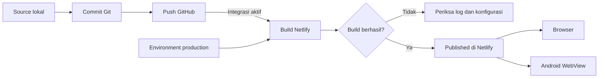
```mermaid
flowchart LR
    S[Source lokal] --> C[Commit Git]
    C --> GH[Push GitHub]
    GH -->|Integrasi aktif| NB[Build Netlify]
    EV[Environment production] --> NB
    NB --> CHECK{Build berhasil?}
    CHECK -->|Tidak| LOG[Periksa log dan konfigurasi]
    CHECK -->|Ya| LIVE[Published di Netlify]
    LIVE --> WEB[Browser]
    LIVE --> APK[Android WebView]
```

1. Hubungkan repository `Fadliyuu/Telkomsatt` ke project Netlify `tsatspare`.
2. Periksa branch produksi pada dashboard, umumnya `main` untuk proyek ini.
3. Base directory adalah root repository. [netlify.toml](netlify.toml) menentukan `npm run build`, publish `.next`, Node.js 22, dan base URL production.
4. Isi keenam variabel Firebase web, konfigurasi Admin, dan Cloudinary di Netlify.
5. Firebase web harus tersedia untuk Builds; Admin/Cloudinary harus tersedia untuk Functions. Gunakan konteks Production dan scope yang sesuai, atau All scopes bila tersedia.
6. Setelah mengubah environment, jalankan deploy baru. Gunakan clear cache bila konfigurasi build lama masih terbawa.
7. Periksa commit serta status Published, lalu uji login, upload, pengajuan, dan verifikasi.

Build lokal tidak membuktikan konfigurasi Netlify lengkap. `.env.local` tidak ikut Git. Proyek membutuhkan API server sehingga tidak dikonfigurasi sebagai static export. Panduan rinci tersedia di [docs/DEPLOY_NETLIFY.md](docs/DEPLOY_NETLIFY.md).

| Kelompok konfigurasi | Lokal | Netlify |
|---|---|---|
| Enam `NEXT_PUBLIC_FIREBASE_*` | `.env.local` | Tersedia ketika build |
| `NEXT_PUBLIC_BASE_URL` | Localhost untuk pengembangan; perhatikan aturan QR | HTTPS production; source menetapkan `https://tsatspare.netlify.app` pada konteks production |
| Firebase Admin | Salah satu format pada langkah instalasi C | Environment server/Functions, proyek yang sama dengan SDK web |
| `CLOUDINARY_*` | `.env.local` | Environment server/Functions |
| `ADMIN_*` dan `SEED_*` | Hanya untuk script yang membacanya | Bukan konfigurasi login pengguna otomatis |

Sesudah deploy, cocokkan commit pada Netlify dengan commit yang diinginkan, lalu uji satu siklus menggunakan akun dan data uji: login → baca inventaris → scan/pilih unit → pengajuan → verifikasi → periksa hasil. Uji juga upload dan unduhan dari browser/Android yang digunakan petugas.

## 18. Build Android

| Pengaturan | Nilai |
|---|---|
| Application ID | `id.co.telkomsat.inventory` |
| Minimum Android | Android 8 / API 26 |
| Compile/target SDK | API 35 |
| Gradle JVM | JDK 21 |
| URL bawaan | `https://tsatspare.netlify.app` |

1. Buka folder `android` di Android Studio.
2. Pilih JDK 21 untuk Gradle dan sediakan SDK Platform 35.
3. Tunggu Gradle Sync.
4. Pilih perangkat/emulator untuk Run atau gunakan menu build APK.

Dari root proyek, dengan Java dan SDK tersedia:

```powershell
.\android\gradlew.bat -p android assembleDebug
```

Hasil: `android/app/build/outputs/apk/debug/app-debug.apk`. Release menggunakan signed APK/AAB dan keystore milik pengelola.

WebView menyediakan izin kamera untuk origin server, pemilih file, tombol Back, ekspor tertentu, dan cetak Android. Ekspor blob/data melalui jembatan aplikasi dibatasi 20 MB serta memerlukan fitur Web Message Listener. Tautan HTTPS di luar server dibuka melalui aplikasi/browser terkait; HTTP tidak diizinkan.

Perubahan web pada URL sama dapat tampil setelah reload. Perubahan native, izin, atau URL tetap memerlukan build ulang. Lihat [android/README.md](android/README.md).

Alamat server diatur pada properti `TELKOMSAT_WEB_URL` di [android/gradle.properties](android/gradle.properties). Gunakan origin HTTPS, misalnya `https://tsatspare.netlify.app`, tanpa path, query, atau fragmen. URL bawaan yang terisi menyembunyikan tombol pengaturan server; nilai kosong memungkinkan pengguna mengisi server melalui aplikasi. Setelah mengganti konfigurasi build ini, buat dan instal APK baru.

## 19. Pengujian dan pemeliharaan

```bash
npm run lint
npx tsc --noEmit
npm run build
node scripts/test-transaction-contracts.cjs
node scripts/test-admin-scan-modes.cjs
node scripts/test-qr-urls.cjs
node scripts/test-pdf-logo.cjs
node scripts/test-ocr.cjs
node android/test-download-hook.cjs
```

| Pemeriksaan | Cakupan dan batas |
|---|---|
| Lint/TypeScript | Aturan kode dan tipe |
| Next.js build | Kompilasi dan halaman dengan environment lokal |
| `test-transaction-contracts.cjs` | Simulasi identitas, metadata, cabang item/katalog, urutan baca-tulis, stok MOVE; tanpa penulisan Firebase |
| `test-admin-scan-modes.cjs` | Render form berdasarkan mode dan simulasi validasi submit/perubahan massal; tanpa koneksi Firebase |
| `test-qr-urls.cjs` | URL publik, data QR lama, preview, unduhan PNG, dan pembuatan item dengan Firebase tiruan |
| `test-pdf-logo.cjs` | Resolusi/proporsi logo, penanganan aset gagal, dan pembuatan lima jenis BA dengan jsPDF; tambah argumen `build/qa-pdf` untuk menyimpan contoh |
| `test-ocr.cjs` | Parser tabel dan siklus worker dengan mesin tiruan; keberhasilan membaca foto perlu diuji terpisah di browser |
| `test-download-hook.cjs` | Simulasi ekspor, ukuran, cetak, instalasi hook berulang; bukan tes HP |
| `test-workflow-rules.js` | Pemeriksaan pola source; bukan pengujian rules pada emulator |
| Android assemble/lint | Build native; bukan bukti integrasi server/kamera |

### Skenario penerimaan

| Skenario | Hasil yang diperiksa |
|---|---|
| Login akun aktif/nonaktif atau password salah | Hanya akses yang memenuhi aturan diterima |
| Menu di luar role | Ditolak/diarahkan |
| QR valid atau tidak dikenal | Detail sesuai atau pesan penanganan |
| OUT/MOVE tanpa SPT | Validasi menolak |
| Pengajuan ganda item sama | Reservasi mencegah pending ganda melalui helper |
| Persetujuan pending | Status, item, stok, verifikator, dan lock konsisten |
| Penolakan pending | Alasan tercatat; stok/lokasi tidak berubah pada jalur penolakan |
| Verifikasi ulang transaksi final | Ditolak |
| Ekspor setelah filter | Isi dan identitas sesuai |
| Izin kamera ditolak, jaringan putus, aplikasi dibuka ulang | Pemulihan dan sesi diperiksa di perangkat |

Uji perubahan database pada proyek uji/emulator sebelum produksi. Konfigurasi emulator dan pengujian integrasinya perlu disiapkan tersendiri; script Node pada tabel tidak otomatis menjalankan emulator.

`seed:data:reset` dan `seed:data:clear-only` mencoba menghapus ID contoh tertentu pada lokasi, katalog, item, dan transaksi, bukan seluruh database. Rules saat ini melarang penghapusan transaksi sehingga tahap clear/reset dapat gagal. Kedua perintah bukan bagian deployment normal. File target `test:push-item` juga belum tersedia, sebagaimana dijelaskan pada tabel perintah proyek.

Pemeliharaan mencakup log Netlify, konsistensi stok/item, akun aktif, rules/index, dependency, dan backup yang dikelola operator. Source ini tidak menyatakan backup, monitoring eksternal, atau pipeline CI pengujian otomatis sudah tersedia.

### Pemulihan pekerjaan yang gagal sebagian

| Kejadian | Langkah berikutnya |
|---|---|
| Pengajuan terputus saat dikirim | Periksa riwayat dan item yang sudah pending sebelum mengirim ulang sisa daftar |
| Scan Gudang menampilkan kegagalan | Cocokkan status/lokasi unit dan Daftar Transaksi; beberapa operasi mungkin sudah tersimpan |
| PDF gagal diunduh setelah proses | Periksa hasil penyimpanan dahulu; jangan mengulangi transaksi hanya untuk memicu unduhan |
| Impor selesai dengan baris gagal | Baca daftar error, cek unit yang berhasil dibuat/diperbarui, lalu perbaiki baris yang gagal |
| Draft lama muncul setelah membuka aplikasi | Periksa isi draft lokal dan buang baris yang sudah selesai sebelum memproses |

Simpan periode, identitas item/transaksi, langkah pemicu, dan pesan error saat melaporkan masalah. Untuk kendala hosting sertakan commit/deploy terkait; hindari menyertakan password, cookie sesi, atau private key.

## 20. Troubleshooting

| Gejala | Pemeriksaan |
|---|---|
| Build `auth/invalid-api-key` | Nilai API key, keenam variabel web, konteks Production, scope Builds, lalu deploy ulang |
| Hanya APP_ID dan Firebase Admin terisi | Tambahkan lima variabel web lainnya; konfigurasi Admin tetap diperlukan |
| `Gagal membuat sesi login` | Respons API sesi, Admin pada Functions, proyek yang sama, format key, dan deploy terakhir; pesan generik ini tidak membuktikan password salah |
| GET sesi 401 tanpa login | Sesuai perilaku endpoint saat cookie tidak tersedia |
| `User data not found` | Cocokkan UID Auth dan dokumen `users/{UID}` |
| Firestore `permission-denied` | Login, role/status, query, dan rules terpasang |
| Riwayat teknisi kosong atau gagal dimuat | Query belum memfilter `requestedByUid` di Firestore sesuai rules; konfirmasi hasil transaksi melalui Admin Gudang |
| Diminta index | Cocokkan query dan deklarasi index pada proyek Firebase yang benar |
| File index tidak ikut deploy Firebase | Tambahkan pemetaan `firestore.indexes` di `firebase.json` sesuai panduan instalasi, lalu deploy ke project ID yang benar |
| Kamera tidak terbuka | HTTPS/localhost, izin kamera, dan Android System WebView |
| QR yang dibuat lokal membuka situs production | Generator mengabaikan origin lokal untuk label publik; atur alamat HTTPS tujuan dan cetak ulang label bila perlu |
| QR lama masih membuka localhost | Unduh/cetak ulang QR; gambar yang telah dicetak tidak berubah saat source diperbarui |
| OCR berhenti saat memuat mesin/bahasa | Periksa koneksi ke jsDelivr, CSP, dan pesan error browser; coba kembali setelah sumber tersedia |
| SN/Tag hasil OCR keliru | Koreksi preview terhadap label asli sebelum impor; confidence tinggi tetap memerlukan pemeriksaan |
| Pengajuan Bawa selalu meminta SPT | Input SPT belum ditampilkan pada keranjang teknisi meskipun validasinya wajib; lihat kendala formulir pada panduan Teknisi |
| Impor menimpa nilai barang lama | SN/Tag yang cocok memicu pembaruan; periksa isi kolom dan nilai default sebelum impor ulang |
| Kategori kosong setelah impor/ekspor | Helper impor belum menyimpan kategori/relasi katalog dan ekspor inventaris mengosongkan kolom tersebut |
| Excel hanya memuat 50 barang atau laporan kurang lengkap | Ekspor inventaris memakai limit bawaan 50 unit; helper laporan memakai limit 100 transaksi sebelum filter tambahan |
| Upload gagal | Ukuran 5 MB, format/isi, token, Cloudinary, dan batas hosting |
| Reset password gagal terkait domain | Base URL dan domain autentikasi Firebase |
| Seed gagal menulis profil | Script klien tunduk rules; bootstrap melalui Console |
| Android tidak memuat web | Koneksi, HTTPS, status deploy, ketersediaan server |
| Gradle menolak Java | Gunakan JDK 21 sesuai konfigurasi proyek |
| Web masih lama | Cocokkan commit, branch, status Published, lalu reload |
| `npm start` belum bisa menjalankan aplikasi | Pastikan `npm run build` selesai dan environment yang diperlukan tersedia |
| Angka dashboard berbeda dari laporan | Samakan periode, filter, tab, sumber data, dan hitungan dokumen dibanding jumlah unit |
| `npm run test:push-item` gagal menemukan modul | File script yang dirujuk belum tersedia; gunakan pemeriksaan yang terdaftar pada bagian pengujian |

## 21. Batasan dan referensi source

- Komentar/helper legacy yang menyebut guest tidak mengaktifkan akses tamu pada rules saat ini.
- Akses UI dan izin Firestore tidak identik. Beberapa rules koleksi lebih luas daripada menu; matriks UI bukan jaminan pembatasan per field.
- Rules notifikasi dan sesi perlu ditinjau jika kebutuhan isolasi data diperketat.
- Rate limiter server memakai penyimpanan dalam proses, bukan pembatas terdistribusi lintas semua instance serverless.
- Audit hanya mencatat aksi yang memanggil helper dan bukan catatan kriptografis yang tidak dapat dipalsukan.
- Konsistensi stok, kegagalan parsial, dan migrasi legacy tetap memerlukan pengujian integrasi dengan data representatif.
- Klasifikasi DISMANTLE legacy belum seragam: dashboard Gudang mengelompokkannya sebagai masuk, sedangkan laporan Gudang sebagai keluar. Periksa catatan transaksi ketika merekonsiliasi data lama.
- Android tidak menyediakan offline penuh atau push notification native melalui FCM.
- Konfigurasi Firebase Storage/Messaging tidak berarti kedua layanan itu dipakai sebagai media utama atau push native. Foto utama memakai Cloudinary; notifikasi aplikasi memakai Firestore.

| Source | Isi |
|---|---|
| [types/index.ts](types/index.ts) | Model, role, jenis transaksi |
| [lib/rbac.ts](lib/rbac.ts) | Akses UI |
| [firestore.rules](firestore.rules) | Aturan data klien |
| [lib/firebase/collections.ts](lib/firebase/collections.ts) | Nama koleksi |
| [lib/firebase/transactions.ts](lib/firebase/transactions.ts) | Pengajuan dan verifikasi |
| [lib/firebase/adminScanSubmit.ts](lib/firebase/adminScanSubmit.ts) | Jalur gudang |
| [components/scan/AdminGudangScanView.tsx](components/scan/AdminGudangScanView.tsx) | Mode, validasi formulir, penyimpanan, dan dokumen scanner gudang |
| [lib/constants/sparepartItem.ts](lib/constants/sparepartItem.ts) | Status, cari fisik, default, dan header Excel |
| [lib/utils/excel.ts](lib/utils/excel.ts) | Pencocokan identitas dan perilaku impor/ekspor |
| [lib/utils/ocrImport.ts](lib/utils/ocrImport.ts) | Parser teks/tabel hasil OCR |
| [lib/utils/ocrRecognition.ts](lib/utils/ocrRecognition.ts) | Siklus pengenalan OCR dan pengelolaan worker |
| [lib/utils.ts](lib/utils.ts) | Pembentukan URL publik QR |
| [lib/pdf/pdfShared.ts](lib/pdf/pdfShared.ts) | Logo dan elemen bersama PDF |
| [app/api/auth/session/route.ts](app/api/auth/session/route.ts) | Sesi |
| [lib/server/firebaseAdmin.ts](lib/server/firebaseAdmin.ts) | Konfigurasi Admin |
| [lib/firebase/audit.ts](lib/firebase/audit.ts) | Aktivitas |
| [.env.example](.env.example) | Nama konfigurasi tanpa kredensial produksi |

Referensi platform: [Next.js](https://nextjs.org/docs), [Firebase Web](https://firebase.google.com/docs/web/setup), [Firebase session cookies](https://firebase.google.com/docs/auth/admin/manage-cookies), [Next.js di Netlify](https://docs.netlify.com/build/frameworks/framework-setup-guides/nextjs/overview/), dan [Mermaid](https://mermaid.js.org/intro/).

[DOKUMENTASI_LENGKAP.md](DOKUMENTASI_LENGKAP.md) melengkapi README dengan prosedur per modul, kontrak API, kamus data, dan [temuan implementasi](DOKUMENTASI_LENGKAP.md#16-keterbatasan-implementasi-yang-diketahui), termasuk integrasi upload, pengelolaan akun, serta perbedaan unit dan katalog. Panduan lama lain dapat memakai istilah/alur sebelumnya; cocokkan dengan source sebelum menjalankannya.
